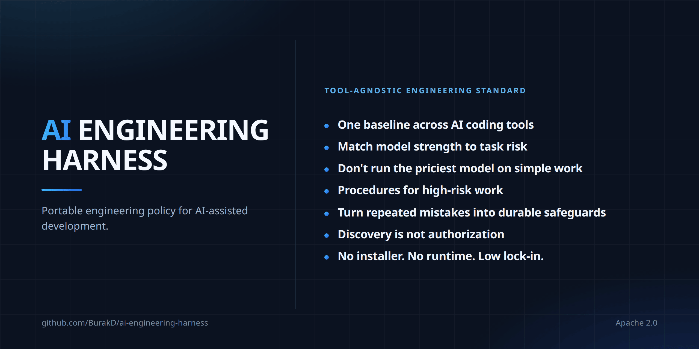

<!-- Based on README.md @ v2.2.0 -->
# AI Engineering Harness



**Languages:** **English** · [Türkçe](i18n/README.tr.md) · [Español](i18n/README.es.md) · [Português (Brasil)](i18n/README.pt-BR.md) · [Deutsch](i18n/README.de.md) · [Français](i18n/README.fr.md) · [Русский](i18n/README.ru.md) · [简体中文](i18n/README.zh-CN.md) · [日本語](i18n/README.ja.md) · [한국어](i18n/README.ko.md) · [العربية](i18n/README.ar.md) · [हिन्दी](i18n/README.hi.md)

A minimal, vendor-neutral baseline for AI-assisted software development.

Switching between AI coding tools or models usually means losing the project's engineering context and re-explaining it. AI Engineering Harness is a small, portable policy/context layer plus a focused set of reusable engineering procedures that prevents that. It is not an agent runtime or orchestrator. Cursor, Claude Code, Codex, Antigravity, Kiro, and other runtimes provide their own execution and orchestration capabilities; this repository is designed to sit alongside them, not replace them.

The harness is designed to solve four practical problems:

1. Keep project context and engineering discipline durable when switching between tools or models.
2. Balance quality and cost by using stronger reasoning only when task complexity or risk justifies it.
3. Keep model/runtime choices current without hard-coding short-lived vendor model names into stable engineering policy.
4. Reuse proven, project-neutral engineering procedures without rebuilding the same review and safety discipline in every repository.

It intentionally stays small. The repository itself is the handoff mechanism; there is no required installer, orchestrator, model gateway, workflow engine, or project-specific framework.

## What you get

- One engineering baseline across tools. Cursor, Claude Code, Codex, Antigravity, and Kiro read the same project context and constraints, so changing tools does not mean re-explaining the project.
- Model choice tied to risk, not habit. Work is classified into capability tiers and starts at the lowest sufficient one. This is policy rather than enforcement: what it actually saves depends on the active runtime and your plan.
- Ready procedures for the work that hurts when it goes wrong. Secret exposure, releases, dependency changes, high-risk changes, and recovery each have a shared procedure, and no procedure may loosen an approval boundary.
- Discovery is not authorization. An agent that notices a problem outside its task reports it and waits for a decision instead of fixing it on its own initiative.
- Fail closed on capabilities. An agent must not claim a model, subagent, or skill activation that the active runtime cannot actually provide.
- Context stays small. Shared procedures load when a task matches them instead of filling every session.
- Low lock-in. Markdown in your repository, with no installer, runtime, or service. Adoption and removal are documented procedures rather than a one-way door.

## Files

- `AGENTS.md` — shared engineering baseline used by compatible coding agents.
- `MODEL_ROUTING.md` — stable FAST / STANDARD / REASONING / FRONTIER quality-cost routing policy.
- `MODEL_CATALOG.md` — time-sensitive model/runtime catalog and recommended current mappings.
- `CLAUDE.md` — thin Claude Code adapter that points to `AGENTS.md`.
- `skills/` — canonical Harness-owned reusable procedures, one `SKILL.md` per skill.
- `README.md` — adoption, update, testing, removal, and maintenance guidance.
- `i18n/` — localized README guidance; the English README remains the maintenance source for operational procedures.
- `LICENSE` — Apache License 2.0.
- `CONTRIBUTING.md` — contribution guidance.

### What this is — and is not

The shared value is the combination of policy and focused procedures: repository-first context, model-routing tiers, fail-closed runtime-capability handling, effect-based human approval, scope discipline, durable handoff, safe adoption/update behavior, and reusable engineering skills that load only when relevant.

It is **not** a spec-driven workflow engine, multi-agent framework, runtime, installer, rule-sync generator, project overlay system, or replacement for tool-native rules and skills. Tool-native mechanisms remain useful for runtime-specific activation; the Harness keeps portable policy and reusable procedures from being trapped in one tool while preserving project-local authority.

### Runtime compatibility and native bridges

`AGENTS.md` is an external cross-tool convention rather than a format invented by this repository. Runtimes that consume it directly need no Harness-specific adapter.

Kiro natively supports the `AGENTS.md` standard in IDE, CLI, Web, and Mobile. A workspace-root `AGENTS.md` is picked up automatically, and Kiro also discovers nested `AGENTS.md` files. Do not create `.kiro/steering/` copies merely to mirror the shared Harness baseline; Kiro-specific steering remains useful for genuinely project-specific Kiro guidance.

Claude Code reads `CLAUDE.md`, so this repository includes only the minimal documented bridge: `CLAUDE.md` imports `@AGENTS.md`. That adapter exists for compatibility, not vendor preference.

Harness-owned canonical skills are different from project-local or tool-native skills. The canonical copies live only under this repository's `skills/` directory. During adoption they may be installed **verbatim** into a verified project-level skill location supported by the runtimes the target repository actually uses. Current verified shared locations include `.agents/skills/` for Cursor, Antigravity, and Codex, `.claude/skills/` for Claude Code, and `.kiro/skills/` for Kiro; Cursor can also consume `.claude/skills/` for compatibility. Native placement is selected from repository evidence and verified runtime support, not from vendor preference or directory symmetry.

Kiro uses progressive disclosure for Agent Skills: workspace skill metadata is available for discovery and the full skill body loads when relevant. Kiro custom agents normally inherit default resources, including workspace skills and `AGENTS.md`; however, that inheritance can be disabled with Kiro's `chat.disableInheritingDefaultResources` setting. If a repository uses Kiro custom agents, adoption must verify the effective inheritance/resource configuration before claiming Harness skill activation. When inheritance is disabled, an explicit resource such as `skill://.kiro/skills/**/SKILL.md` can expose the Harness skills to a custom agent. Do not silently rewrite project-local Kiro agent definitions merely to enable this; report the limitation and wait for approval if a project-local agent configuration must change.

Project-local and tool-native skills, rules, steering, agents, workflows, and other runtime artifacts remain project-local. The Harness does **not** copy, generate, mirror, migrate, or synchronize them. In particular, `.agents/workflows/` and `.kiro/steering/` remain outside the shared Harness. The only narrow exception is verbatim placement of explicitly Harness-owned canonical skills for verified native activation.

## License

This project is open source under the **Apache License 2.0**.

You may use, modify, redistribute, and use the project commercially under the license terms. Copyright, license, patent, trademark, and attribution obligations remain governed by `LICENSE`.

Contributions are welcome and are submitted under the Apache License 2.0 unless explicitly stated otherwise, as described in `CONTRIBUTING.md`.

## Rules and skills: four layers

| | Always-on | On-demand |
| --- | --- | --- |
| **Shared** | `AGENTS.md` + `MODEL_ROUTING.md` — the Harness rule layer | `skills/` — Harness-owned reusable procedures |
| **Project-specific** | The project's own rule/policy mechanism — Harness does not modify it | The project's own skills — Harness does not modify them |

The Harness intentionally does **not** ship a separate `rules/` directory. Shared always-on guidance already has a canonical home in `AGENTS.md` (with model-routing policy in `MODEL_ROUTING.md`); adding a second canonical always-on rule source would create duplication and conflict risk.

Domain rules, environment and deployment topology, vendor/model preferences, product behavior, business rules, infrastructure paths, and similar project facts stay project-local and are not promoted into shared Harness files. When deciding where new guidance belongs, use the `continuous-improvement` skill to choose the smallest durable safeguard and the appropriate shared or project-local layer rather than duplicating the decision framework here.

## Shared skills

The shared skills layer exists because some engineering procedures are useful across unrelated projects and expensive to reconstruct repeatedly. Skills are **task-specific procedures**, not always-on policy. A runtime should normally expose only skill metadata for discovery and load a skill body when the current task actually matches it.

The canonical source is this repository's `skills/` directory. Every Harness-owned skill carries this frontmatter ownership marker:

```yaml
metadata:
  ai-engineering-harness: "2.0.0"
```

The key identifies Harness ownership; the value records the canonical Harness version for that skill content. Installed Harness-owned copies remain verbatim copies of canonical `skills/<name>/SKILL.md`. A same-name skill without this metadata key is not Harness-owned and must never be overwritten by adoption or update.

The v2 shared set contains 15 procedures:

- `backup-and-recovery-review` — reviews backup, restore, and recovery readiness for persistent assets and services.
- `interface-qa` — validates changed user or consumer interfaces across web, mobile, desktop, CLI, or API surfaces.
- `calculation-model-validation` — validates formulas and decision models using boundaries, precision checks, invariants, and behavioral comparison.
- `change-review` — reviews completed changes for correctness, regressions, edge cases, security, compatibility, and missing validation.
- `compatibility-and-rollout` — plans mixed-version compatibility, migration sequencing, staged activation, deprecation, and rollback.
- `high-risk-change-review` — adds stricter planning, validation, review, and approval discipline to materially risky changes.
- `delegation-strategy` — decides when verified runtime delegation or isolated review is worth its coordination cost.
- `dependency-change` — evaluates dependency additions, removals, and upgrades for necessity, maintenance, security, compatibility, and operational impact.
- `documentation-sync` — keeps durable project documentation aligned with implementation and operating reality.
- `environment-release-safety` — validates release/deployment actions against the project's actual topology, effects, recovery path, and approval boundaries.
- `automation-cost-control` — controls metered automation compute cost through real-spend attribution, cheapest-capable execution, runtime bounds, and verification that cost-driven conditions do not silently skip required work.
- `continuous-improvement` — converts recurring failure classes into the smallest durable engineering safeguard.
- `root-cause-debug` — investigates defects by testing hypotheses, identifying the underlying cause, and proving the fix with regression evidence.
- `secret-exposure-response` — handles suspected secret or credential exposure without reproducing secret values and without confusing cleanup with rotation/revocation.
- `cross-surface-consistency` — checks equivalent capabilities for accidental behavioral drift across multiple interfaces or channels.

The inclusion bar is deliberately high. A shared skill should be project-neutral, reusable across unrelated repositories, procedural rather than product-specific, narrow enough for meaningful triggering, and valuable enough to remove demonstrated recurring cost or risk. Before proposing a new skill, prefer extending or tightening an existing one when that preserves clear boundaries.

To resist context and maintenance sprawl, keep the shared set at roughly **20 skills or fewer**. A proposal that would exceed that level should either retire/merge an existing skill or explicitly justify why the procedure cannot fit an existing skill without making that skill incoherent. Skill `description` fields should stay at **300 characters or fewer** so discovery metadata remains compact without sacrificing trigger quality.

Skill precedence is defined by `AGENTS.md`: **project-local rules and project policy > shared `AGENTS.md` baseline > shared skills**. A shared skill never weakens approval boundaries, authorized scope, runtime-capability constraints, or production/live safety.

## Install / adopt in 3 steps

For an existing project, the recommended path is **in-place AI-assisted adoption**.

1. Open the project exactly where you normally work, on the branch you normally intend to use.
2. Paste the adoption prompt below into a capable coding agent.
3. Review the resulting Git status, diff, backup locations, skill-placement report, and project-readiness findings before accepting or committing anything.

**Do not create a new branch, worktree, project copy, installer, or temporary clone of the target project merely to adopt this Harness.** Use one only if the user explicitly asks for isolation or the target repository's own policy requires it.

For one-time adoption, prefer a capable/reasoning model because it must inspect and preserve existing project rules safely. After adoption, normal model routing applies.

If you want a specific communication language, prepend one short line such as `Respond in Turkish.` or `Respond in English.`.

### Copy/paste adoption prompt

```text
Adopt the current AI Engineering Harness from
https://github.com/BurakD/ai-engineering-harness
into this repository, in place, on the current branch.

First inspect this repository and the Harness source. Follow the current README's existing-project adoption procedure exactly.

Use the communication language explicitly requested by the user or already defined by this repository. If neither exists, continue in the language established in the surrounding conversation rather than inferring it from this pasted template.

Do not create or switch to a new branch, worktree, project copy, or duplicate checkout merely for this adoption. Stay in the current working repository and branch unless I explicitly ask otherwise or this repository's own documented policy requires isolation.

Before changing anything:
- inspect the current branch and working-tree status;
- discover existing AGENTS.md, CLAUDE.md, repository-local AI rules, tool-native rules/skills, Kiro `.kiro/` steering/skills/agents where present, docs, ADRs, tests, CI/release/deployment conventions, and other canonical project instructions;
- discover the project's environment and release topology from repository evidence: which environments exist (if any), which are customer-facing/live, which branches/tags/releases/actions deploy or publish to them, which deployments are automatic, and which actions already require human approval;
- discover the documented build/test/lint/analysis commands and any project-local model/subagent/cost policy;
- identify which AI runtimes are actually used by this repository from repository evidence. A CLI or application merely being installed on the machine is not evidence that this repository uses that runtime;
- identify every existing file you may need to modify.

For native shared-skill placement, use only currently verified project-level paths:
- Cursor, Antigravity, and Codex may use `.agents/skills/`;
- Claude Code uses `.claude/skills/`;
- Kiro uses `.kiro/skills/`;
- Cursor can also read `.claude/skills/` for compatibility.
If all detected runtimes can use one verified project-level skill root, install one copy there. Do not create a second copy merely for symmetry. If a detected runtime's native skill path cannot be verified, do not guess one; use the neutral `harness/skills/` location for the Harness-owned skills that cannot be safely placed natively and do not claim native activation for that copy.

Kiro-specific compatibility rules:
- Kiro natively discovers workspace-root and nested AGENTS.md files, so do not create `.kiro/steering/` copies merely to mirror the Harness AGENTS.md baseline;
- Kiro workspace skills live under `.kiro/skills/` and use progressive disclosure;
- if Kiro custom agents are used, inspect whether default-resource inheritance is enabled and whether agent resources already expose the workspace skills. Do not claim Harness skill activation for a custom agent when the effective configuration does not expose those skills;
- if default-resource inheritance is disabled, `skill://.kiro/skills/**/SKILL.md` is a valid explicit custom-agent resource for workspace Harness skills. Do not edit `.kiro/agents/` merely to add it without explicit human approval; report the exact affected agent file and recommended change instead.

Before writing any Harness skill anywhere:
- enumerate the canonical Harness skill names from the upstream `skills/` directory;
- determine every target skill root that would be used;
- scan all target roots for collisions for every canonical Harness skill name before writing any skill;
- a same-name skill whose frontmatter metadata contains the `ai-engineering-harness` key is a managed Harness-owned copy and may be updated;
- a same-name skill without that metadata key is project-local or otherwise unowned by the Harness: do not overwrite, rename, merge, or modify it. Stop the shared-skill installation phase and report the collision. The rest of the Harness adoption may continue if it is otherwise safe.

Do not ask me to restate facts that the repository already answers. Do not assume environment names such as dev, stage, staging, prod, or production, and do not assume that the project has exactly two environments or any deployment environments at all.

If repository evidence is missing, stale, contradictory, or genuinely ambiguous:
- do not invent a deployment, release, approval, build/test, model-routing, runtime, native skill path, or tool-native policy;
- ask only focused questions that materially affect safe Harness adoption itself;
- otherwise continue the minimal Harness adoption without guessing, and report the unresolved item in the final Project readiness section for human follow-up.

Backup requirement:
- before modifying any existing file, including an existing Harness-owned skill, create a byte-for-byte backup of that file outside the repository, preferably in the operating system's temporary directory;
- report the exact backup path(s) in your final summary;
- do not create backup copies inside the repository unless I explicitly ask for that;
- if you cannot create a safe backup outside the repository, stop before modifying the file and explain why.

Preserve all existing project-specific content, rules, skills, docs, tests, deployment conventions, uncommitted work, and tool-specific value.

Apply the Harness minimally:
- if AGENTS.md does not exist, copy the Harness AGENTS.md verbatim;
- if AGENTS.md already exists, preserve it exactly outside the documented shared-baseline markers and append/update the shared Harness AGENTS.md verbatim inside those markers;
- MODEL_ROUTING.md must remain a verbatim copy of the Harness MODEL_ROUTING.md when Harness-owned;
- MODEL_CATALOG.md must remain a verbatim copy of the shared current catalog when Harness-owned; do not move project-local model preferences into it;
- install canonical Harness-owned `skills/<name>/SKILL.md` files verbatim into the selected verified native skill root(s), including `.kiro/skills/` when Kiro is the selected verified runtime root, or into neutral `harness/skills/` when native activation cannot be verified or is not desired;
- never edit a copied Harness skill to make it project-specific; project-specific guidance stays in project-local rules, docs, tests, configuration, or separate project-owned skills;
- if the project already has local model/tool routing rules, preserve them where they are; do not copy, summarize, map, or duplicate those project-specific model names or policies into MODEL_ROUTING.md or MODEL_CATALOG.md;
- if existing project-local routing appears semantically incompatible with the shared tier policy, do not invent a reconciliation or mapping. Stop and report the conflict for human review;
- add the thin CLAUDE.md adapter if Claude Code is used now or is intended to be used with this project. If CLAUDE.md already exists, preserve its existing value and add the shared AGENTS.md reference rather than replacing it. If Claude Code is definitely not used for this project, CLAUDE.md may be omitted.

Do not copy, symlink, generate, mirror, or synchronize project-local/tool-native skills or rules merely to make them look portable across tools.
Do not create `.agents/workflows/`, `.ai/`, `.kiro/steering/` mirrors, installers, manifests, orchestration, project overlays, extra adapters, or unrelated process files. `.agents/skills/` and `.kiro/skills/` may be created only when needed for verified Harness-owned native skill activation.
Do not modify application code merely to install the Harness.
Do not silently edit existing project-local deployment, release, environment, Git, model-routing, rules, skills, Kiro custom-agent configuration, or documentation files merely to resolve a discovered ambiguity. In the final report, recommend the smallest existing project-local file(s) that should record each durable clarification, and wait for explicit approval before changing them.
Do not commit, push, merge, deploy, publish, access production/live systems, or perform unrelated cleanup.

When finished:
1. show git status;
2. show the exact Harness-related diff;
3. list every file changed or added;
4. list the backup path for every existing file you modified;
5. explain what project-specific content/rules you preserved and any conflicts;
6. confirm that AGENTS.md shared content, MODEL_ROUTING.md, MODEL_CATALOG.md, the shared portion of CLAUDE.md, and every installed Harness-owned skill follow the upstream Harness source as required;
7. report the detected AI runtimes and the repository evidence for each;
8. report the selected skill root(s), why each root was chosen, how many Harness skills were installed or updated, every collision found, and whether each managed installed copy is verbatim-equal to its canonical upstream `skills/<name>/SKILL.md`; for Kiro, distinguish default-resource activation from any custom-agent configuration that disables inheritance;
9. report the exact upstream Harness commit used;
10. confirm that no unrelated file was changed and that no branch/worktree/project copy was created for adoption;
11. provide a Project readiness section covering, when applicable:
   - environment/deployment topology;
   - customer-facing/live publication boundary;
   - branch/tag/release/deployment triggers;
   - build/test/lint/analysis commands;
   - model/tool-specific routing or cost policy;
   - runtime/skill activation status;
   - stale, contradictory, or unresolved project instructions.
   Mark each item as clear, unresolved, or not applicable. For each unresolved item, ask the smallest focused question needed and recommend the exact existing project-local file(s) where the durable answer should be recorded after approval.

Stop after the adoption review and wait for human approval. Do not resolve Project readiness questions by editing project-local files until I explicitly approve those edits.
```

This prompt is intentionally generic. It can be pasted into an existing project without changing the project name, technology stack, environment names, or deployment topology.

## Core principles

### Repository truth survives model switches

A new model or agent should be able to reconstruct the current state from the repository rather than depending on previous chat history.

Project code, tests, documentation, ADRs, CI/release conventions, repository-local instructions, and current Git state remain the source of truth.

### Add; do not replace

The Harness must adapt to an existing project instead of forcing the project into a new structure.

Do not migrate or duplicate project-specific rules merely to fit the Harness. Existing tool-native rules and skills, repository instructions, documentation, ADRs, tests, deployment conventions, and other local assets stay where they are unless the project independently decides to change them.

The narrow v2 exception is **Harness-owned canonical skills**: they may be copied verbatim from canonical `skills/` into the smallest verified native skill root set needed for activation. That exception does not make project-local skills portable Harness content. The Harness still does not copy, translate, symlink, generate, mirror, migrate, or synchronize project-local/tool-native skills, rules, or workflows across runtimes.

Durable project truth must not live only inside one tool's native skill or rule directory. Keep shared project truth in docs, ADRs, tests, scripts, code/configuration, and `AGENTS.md`, where another tool or human can reconstruct it.

Tool-native model names, subagent types, agent APIs, skills, and invocation syntax are runtime-scoped. Another runtime may read them for context but must not claim it can invoke them unless that capability is actually verified in the active runtime/session. Shared intent may be preserved using the closest real capability; fake cross-tool delegation is not allowed.

### Stable policy, updateable catalog

`MODEL_ROUTING.md` is stable policy. `MODEL_CATALOG.md` is deliberately time-sensitive.

A change in model names, plan availability, pricing, runtime picker contents, or vendor releases should normally update `MODEL_CATALOG.md`, not the capability-tier definitions. The active runtime remains the ultimate source of truth for what it can actually invoke.

Project-specific model preferences stay project-specific and may override catalog defaults when compatible with the shared routing policy.

### Project-specific knowledge stays project-specific

Do not copy product names, business rules, architecture decisions, environment details, release procedures, language preferences, credentials, or domain knowledge into this shared Harness repository.

The shared files and skills define process defaults and reusable procedures, not product truth.

### Prefer deterministic safeguards

Tests, type/schema constraints, analyzers, linters, builds, CI checks, and scripts are preferred to repeated model judgment when they can enforce the same rule reliably.

### Human approval is defined by effect, not tool

High-impact actions require explicit approval regardless of whether they are performed through an IDE, CLI, agent, or another runtime. The exact approval boundary is defined in `AGENTS.md`.

Environment names are project-specific. The shared Harness distinguishes customer-facing/live publication from other environments by effect, not by assuming conventional names. Non-production deployment and mutation policy stays project-local.

These files provide agent context, not hard enforcement. If an action must be technically impossible rather than merely prohibited by instruction, use the active tool's project-local permission, deny, or hook mechanism; that configuration stays outside this shared repository.

## Existing-project adoption details

The preferred model is **inspect, preserve, back up, then add — in place**.

1. Stay in the current project and current branch unless the user explicitly requests isolation or repository policy requires it.
2. Inspect current branch and working-tree state.
3. Discover repository-local instructions, docs, ADRs, tests, CI/release conventions, deployment evidence, existing tool-native rules/skills, and documented validation commands.
4. Reconstruct environment/release topology from evidence without assuming environment names, count, promotion flow, or deployment automation.
5. Detect AI runtimes from repository evidence; an installed CLI alone is insufficient.
6. Choose the smallest verified set of native skill roots. `.agents/skills/` currently covers Cursor, Antigravity, and Codex; `.claude/skills/` covers Claude Code and can also be consumed by Cursor; `.kiro/skills/` covers Kiro. Use one copy when one root covers all detected runtimes. Use neutral `harness/skills/` for any placement that cannot be verified natively, and do not claim native activation for it. For Kiro custom agents, verify effective default-resource inheritance before claiming that workspace skills are available to that agent.
7. Before writing any skill, scan all selected roots for every canonical Harness skill name. Managed ownership is established only by the `metadata.ai-engineering-harness` key. An unowned same-name collision stops the skill-installation phase but does not automatically block the rest of Harness adoption.
8. Before modifying any existing file, including managed skills, make a byte-for-byte backup outside the repository.
9. Add/update `AGENTS.md`, `MODEL_ROUTING.md`, `MODEL_CATALOG.md`, and the minimal `CLAUDE.md` adapter according to their ownership rules.
10. Install Harness-owned skills verbatim from canonical `skills/` into selected roots. Never rewrite them into project-specific variants.
11. Do not create `.ai/`, `.agents/workflows/`, `.kiro/steering/` mirrors, installers, manifests, orchestration, project overlays, or extra adapters. `.agents/skills/` and `.kiro/skills/` may be created only for verified Harness-owned native skill activation.
12. Review the exact diff, verify every managed installed skill against canonical content, report the exact upstream commit, and stop for human review before commit/push/deploy/publish.

### If the project has no `AGENTS.md`

Copy `AGENTS.md` byte-for-byte from this repository. Do not summarize, rewrite, or regenerate it from the README. Kiro consumes a workspace-root `AGENTS.md` directly; do not duplicate that shared baseline into `.kiro/steering/` merely for Kiro compatibility.

### If the project already has `AGENTS.md`

Do not rewrite or condense the existing file. Back it up first, then append the shared baseline as one clearly marked block:

```text
<!-- BEGIN shared engineering baseline — ai-engineering-harness @ YYYY-MM-DD -->
[verbatim contents of this repository's AGENTS.md]
<!-- END shared engineering baseline -->
```

Change nothing outside the markers. If the markers already exist, updating the Harness means replacing only the content between them with current upstream `AGENTS.md` and updating the date.

Project-local rules remain authoritative even when the shared block appears later in the file.

### MODEL_ROUTING.md, MODEL_CATALOG.md, and local routing rules

`MODEL_ROUTING.md` is the shared, vendor-neutral capability-tier policy and should remain verbatim.

`MODEL_CATALOG.md` is the shared, time-sensitive catalog and should remain verbatim when installed as Harness-owned content.

Projects may keep tool-specific routing rules, model names, subagent policies, or cost controls in their normal local locations. Do not mirror those details into shared model files. If project-local policy and the shared tier policy genuinely conflict, stop and ask for human review rather than inventing a mapping.

## Update an existing installation

An update refreshes only Harness-owned shared content and preserves project-local value and the existing skill placement.

1. Inspect the target repository and current upstream Harness, including all installed Harness-owned skill roots and `metadata.ai-engineering-harness` markers.
2. Record the exact upstream commit.
3. **Do not move an existing managed skill installation** merely because a different path is now preferred or newly supported.
4. Back up every existing Harness-owned file that will change, byte-for-byte, outside the repository.
5. Refresh the shared `AGENTS.md` baseline only inside its markers where applicable.
6. Refresh Harness-owned `MODEL_ROUTING.md`, `MODEL_CATALOG.md`, and the shared portion of `CLAUDE.md` according to their existing ownership rules.
7. For each installed Harness-owned skill that still exists upstream: backup → verbatim replace from canonical `skills/<name>/SKILL.md`.
8. For each new upstream skill: add it to existing managed Harness skill root(s) only when there is no unowned same-name collision.
9. Never modify project-local or otherwise unowned skills/rules. An unowned same-name collision is reported and left untouched.
10. If a managed installed Harness skill no longer exists upstream, **do not delete it automatically**. Report it as an **orphaned Harness skill** and ask for human review.
11. Never migrate or synchronize project-local/tool-native skills, rules, workflows, model mappings, or invocation syntax between runtimes.
12. Verify every managed skill with an upstream counterpart is verbatim-equal to the canonical upstream file. Report roots, updated/new/colliding/orphaned skills, backup paths, mismatches, and exact upstream commit.
13. Review the exact diff and run applicable installation tests. Do not commit, push, deploy, or publish merely to update the Harness.

### Copy/paste update prompt

```text
Update the AI Engineering Harness already installed in this repository from the current upstream source:
https://github.com/BurakD/ai-engineering-harness

Follow the current upstream README's "Update an existing installation" procedure exactly. Treat that README as the maintenance source of truth; do not rely on an older copied prompt or previous chat history.

Stay in this repository and on the current branch unless this repository's documented policy requires otherwise. Do not create a branch, worktree, duplicate checkout, installer, or synchronization script merely for this update.

Before changing anything:
- inspect current branch and working-tree status;
- inspect installed AGENTS.md, MODEL_ROUTING.md, MODEL_CATALOG.md, CLAUDE.md where present, shared-baseline markers, relevant Kiro `.kiro/` configuration where Kiro is used, and relevant project-local/tool-native rules;
- discover every installed Harness-owned skill root and every skill whose frontmatter metadata contains the `ai-engineering-harness` key;
- inspect current upstream AGENTS.md, MODEL_ROUTING.md, MODEL_CATALOG.md, CLAUDE.md, README.md, and canonical `skills/`;
- record the exact upstream commit being applied;
- identify every existing file that would be modified.

Do not relocate existing Harness-owned skills during an update. Preserve each managed installation root even if a different native path is now preferred or newly available. In particular, do not move an existing managed skill installation into `.kiro/skills/` merely because Kiro support was added later; new adoption may use `.kiro/skills/`, while existing installations preserve their managed placement unless the human explicitly requests migration.

Before modifying each existing file, including each managed Harness skill, create a byte-for-byte backup outside the repository and report its exact path.

Preserve all project-local content, rules, docs, skills, model mappings, uncommitted work, application code, deployment conventions, and tool-specific value.

Update only Harness-owned shared content:
- refresh only the shared AGENTS.md baseline inside its markers; preserve everything outside the markers exactly;
- keep Harness-owned MODEL_ROUTING.md and MODEL_CATALOG.md verbatim with current upstream;
- refresh only the shared CLAUDE.md adapter portion where applicable;
- for each installed skill carrying `metadata.ai-engineering-harness`, if the canonical skill still exists upstream, back up the installed SKILL.md and replace it verbatim with the upstream canonical SKILL.md;
- when upstream contains a new Harness skill, add it to existing managed Harness skill root(s) only if no unowned same-name skill exists there;
- if the same name exists without the `ai-engineering-harness` metadata key, do not overwrite, merge, rename, or modify it; report the collision;
- if a locally installed managed Harness skill no longer exists upstream, do not delete it. Report it as an orphaned Harness skill and ask for a human decision;
- never copy, translate, migrate, synchronize, or treat project-local/tool-native skills, rules, workflows, model names, agents, subagents, or invocation syntax as Harness-owned content or as capabilities of another runtime.

If Kiro is used, verify that its current AGENTS.md and skill-discovery behavior remains available in the active runtime/version. For Kiro custom agents, verify effective default-resource inheritance before claiming activation. Do not silently alter `.kiro/agents/`, `.kiro/steering/`, or other project-local Kiro configuration to resolve activation gaps; report the exact gap and wait for approval.

If current project-local instructions conflict semantically with the new shared policy, do not invent a reconciliation. Stop before rewriting project-local policy and report the exact conflict for human review.

If a project-local preferred model is no longer supported by the current catalog or live runtime, do not silently replace it. Report the stale preference and the closest current options for human review.

Do not modify application code, project-local deployment/release policy, tool-native rules/skills, or project documentation merely to make the Harness update look clean.
Do not commit, push, merge, deploy, publish, or access production/live systems.

When finished:
1. show git status and the exact Harness-related diff;
2. report the exact upstream Harness commit used;
3. list every changed file and backup path;
4. list every managed Harness skill root and confirm its placement was preserved;
5. report skills updated, newly added, skipped because of unowned collisions, and orphaned Harness skills awaiting human review;
6. verify and report verbatim equality between every managed installed Harness skill with an upstream counterpart and its canonical upstream file;
7. identify semantic conflicts, stale project-local model choices, runtime-specific activation gaps, or project-local instructions made stale by the new shared policy/catalog;
8. confirm unrelated and project-local content was preserved;
9. run applicable README installation tests, including the cross-tool runtime-capability test where multiple runtimes are used;
10. stop for human review.
```

## Remove the shared skills

There is intentionally no uninstaller. Removal is explicit and ownership-based:

1. Discover installed skill roots and identify only skills whose `SKILL.md` frontmatter contains `metadata.ai-engineering-harness`.
2. Confirm each candidate is actually Harness-owned before deleting it. Never remove a same-name project-local skill that lacks the ownership marker.
3. Remove only those Harness-owned skill directories from their current managed root(s). This includes `.kiro/skills/` when that is the managed Kiro placement. If the repository uses neutral `harness/skills/`, the same ownership test applies there.
4. If the repository's `AGENTS.md` contains the shared Harness baseline block, remove or update that block only according to the repository's chosen Harness-removal scope; preserve all project-local content outside the markers. Do not remove project-local Kiro steering or agent configuration merely because the Harness is being removed.
5. If removing the Harness entirely, review `MODEL_ROUTING.md`, `MODEL_CATALOG.md`, and the shared `CLAUDE.md` adapter separately according to their ownership and preservation rules.
6. Review the final diff and verify no project-local rules, skills, docs, code, or unrelated runtime artifacts were removed.

## Manual fallback

If your coding agent cannot access the upstream source or you prefer manual installation, copy only the shared files you need.

For a new project with no existing `AGENTS.md`, copy `AGENTS.md`, `MODEL_ROUTING.md`, `MODEL_CATALOG.md`, and `CLAUDE.md` when Claude Code is used. Kiro consumes the workspace-root `AGENTS.md` directly, so no Kiro-specific steering copy is needed for the shared baseline. For Harness skills, prefer a verified native project-level skill root: `.kiro/skills/` for Kiro, or the corresponding verified root for the other runtimes in use. When native activation cannot be verified or is not desired, place verbatim Harness-owned skill copies under neutral `harness/skills/` and use them only as on-demand repository guidance. Do not claim that neutral copies are natively active.

For existing projects, never blindly overwrite files or skills. Follow the collision, backup, ownership, and preservation rules above.

## How to test an installation

Test from a **fresh agent chat/session** so results do not depend on the installation conversation.

### 1. Structural smoke test

Ask the agent:

```text
Do not change any files. Inspect this repository and report:
- the current branch and working-tree state;
- which repository-local instructions, rules, docs, tests and deployment/release conventions apply;
- which environments/deployment targets exist, if any, which are customer-facing/live, and what repository actions trigger deployment or publication;
- the model-routing tier for this read-only investigation and why;
- the current model/runtime catalog guidance relevant to this active runtime, if any;
- the documented build/test/lint/analysis commands you would use for a normal code change;
- which actions require explicit human approval;
- any stale, contradictory, or unresolved project instructions that could materially change behavior.
```

A healthy installation should discover `AGENTS.md`, project-local rules, `MODEL_ROUTING.md`, and `MODEL_CATALOG.md`; respect dirty Git state; avoid assuming environment names or topology; identify approval boundaries; and surface material ambiguity without relying on previous chat history.

### 2. Real-task behavior test

In another fresh session, give a normal non-trivial project request but explicitly ask for analysis only:

```text
I want to make a small but non-trivial change in this project. Do not edit files yet. Inspect the existing implementation and project rules first, then tell me whether the change is actually needed, what would be affected, the appropriate model-routing tier, which currently available model/mode you would actually use in this runtime, risks, and how you would validate it.
```

The agent should inspect repository evidence before proposing work, notice relevant local rules and dirty files, avoid inventing undocumented commands, and avoid unnecessary implementation if requested behavior already exists.

### 3. Approval-boundary test

```text
Do not perform any Git, release, deployment or production/live action. Based on this repository's instructions, identify any repository action that would trigger deployment or publication to a customer-facing/live environment and tell me whether that exact action may be performed without explicit human approval. If the repository does not define such an environment or trigger, say so instead of inventing one.
```

Expected: no invented production model and no weakening of explicit human gates.

### 4. Cross-tool runtime-capability test

Run this from a fresh session in each AI runtime you actually use:

```text
This repository may contain tool-native model, agent, subagent, rule, or skill instructions for tools other than the one you are currently running in.

Do not change any files.

Assume a medium-complexity development task has arrived. Based on the installed AI Engineering Harness and this repository:
- describe the stages and model/agent roles you would actually use;
- distinguish shared Harness policy/catalog guidance from tool-native project instructions;
- name only models, agents, subagents, modes, or delegation mechanisms that this current runtime can actually use;
- if another tool's native rule names a capability unavailable here, explain how you preserve its intent without pretending you can invoke it;
- if MODEL_CATALOG.md conflicts with live runtime availability, follow the live runtime and flag the catalog entry as potentially stale.
```

Expected: capability claims fail closed when live verification is unavailable.

### 5. Shared-skill discovery and activation test

Run from a fresh session in each runtime that the repository expects to use shared skills:

```text
Do not change any files.
Inspect the installed Harness-owned skills and the active runtime's verified skill-discovery behavior.

First, identify the installed Harness skill root(s), whether this runtime can natively discover each root, and which ownership marker distinguishes managed Harness skills from project-local skills.

Then consider two hypothetical tasks:
1. a defect with an unclear underlying cause;
2. a trivial documentation typo with no behavioral or operational effect.

For each task, tell me which shared skill, if any, should be activated and why. Do not execute the task.
If this runtime's native skill activation cannot be verified, say that the skills are available only as repository guidance and do not claim native activation.
If this is Kiro and a custom agent is active, also report whether default-resource inheritance is enabled or whether an explicit `skill://` resource exposes the workspace skills.
Also state whether full bodies of unrelated skills should be loaded for either task.
```

Expected behavior:

- The root-cause task should make `root-cause-debug` relevant; unrelated skill bodies should remain unloaded unless another skill is independently relevant.
- The trivial typo should not cause all shared skill bodies to enter context. Discovery metadata may be visible, but progressive disclosure should keep irrelevant bodies out of the working context.
- A runtime with unverified native skill discovery must **not** claim that a skill is natively active. A neutral `harness/skills/` copy is repository guidance unless native activation is independently verified.
- In Kiro, `.kiro/skills/` is the verified workspace skill root. A custom agent may inherit those default resources, but if default-resource inheritance is disabled, the agent must not claim access unless its effective resources expose the skills (for example with `skill://.kiro/skills/**/SKILL.md`).
- Project-local policy remains higher precedence than shared skills, and any conflict must be reported rather than silently resolved in favor of the skill.

Passing these smoke tests is evidence that shared context and skill discovery are behaving as designed. It is not proof of hard enforcement; use runtime-native permissions, deny rules, hooks, CI, tests, and other deterministic controls when an operation must be technically impossible.

## Model routing and catalog maintenance

`MODEL_ROUTING.md` defines stable capability tiers:

- **FAST** — small/mechanical work.
- **STANDARD** — normal implementation and bounded fixes.
- **REASONING** — difficult, ambiguous, architectural, security-sensitive, compatibility-sensitive, or release-sensitive work.
- **FRONTIER** — exceptional hardest cases; manual escalation only.

`MODEL_CATALOG.md` records current runtime-specific options and is expected to change more frequently. Its own maintenance section contains a catalog-refresh prompt. Adopting projects receive shared catalog changes through the normal Harness update procedure.

Project-specific rules may raise the minimum tier for a sensitive area or choose different current models. Such overrides belong in that project, not in the shared catalog.

## Durable learning from AI mistakes

When a correction is likely to matter again, prefer the smallest durable safeguard: deterministic test or invariant, static/runtime check, script or hook, focused skill, concise always-on rule, or documentation improvement as appropriate.

Project-specific mistakes stay project-specific. When a repeated failure class is genuinely project-agnostic, reusable across unrelated repositories, and procedural rather than product-specific, promotion into an existing shared skill — or exceptionally a new shared skill within the set-size discipline above — is a legitimate Harness improvement target.

Do not promote one project's local lesson merely because it was costly. Shared promotion requires evidence of reusable value and a clear boundary.

## Maintenance

Keep stable process in `AGENTS.md`, stable tier definitions in `MODEL_ROUTING.md`, changing runtime/model information in `MODEL_CATALOG.md`, and reusable task-specific procedures in canonical `skills/`.

Keep Harness-owned skill bodies concise and project-neutral. Preserve the ~20-skill ceiling and 300-character description budget unless there is a documented reason to change those constraints.

For installed projects, use the current upstream **Update an existing installation** procedure rather than maintaining a separate synchronization mechanism. Updates preserve existing skill placement and never silently overwrite or remove project-local skills.

## Scope boundaries and future extensions

v2 adds a small shared Agent Skills layer because repeated cross-project reuse cost has now been demonstrated in real project work.

The shared skills remain concise, project-neutral, and procedure-focused. They do not introduce project overlays, shared project configuration, installers, manifests, rule synchronization, or a Harness-owned runtime.

Other extensions previously considered — such as templates, project overlays, richer runtime adapters, automated installation, and orchestration — remain deferred. Add them only when repeated real-world evidence shows that the current repository-first policy + skills approach cannot solve the problem cleanly.
