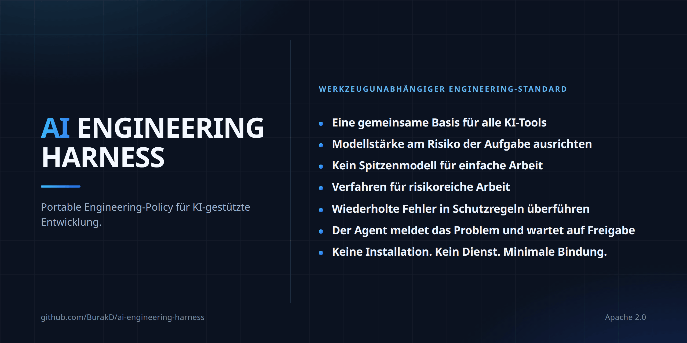

<!-- Based on README.md @ v2.0.4 -->
# AI Engineering Harness



Sprachen: [English](../README.md) · [Türkçe](README.tr.md) · [Español](README.es.md) · [Português (Brasil)](README.pt-BR.md) · Deutsch · [Français](README.fr.md) · [Русский](README.ru.md) · [简体中文](README.zh-CN.md) · [日本語](README.ja.md) · [한국어](README.ko.md) · [العربية](README.ar.md) · [हिन्दी](README.hi.md)

Eine minimale und anbieterneutrale (vendor-neutral) Policy-/Kontextschicht für AI-gestützte Softwareentwicklung mit einem kleinen Satz wiederverwendbarer Verfahren. Sie ist kein agent runtime (Agenten-Laufzeitsystem), kein orchestrator (Koordinationssystem), kein installer (Installationswerkzeug) und kein framework (Software-Framework).

## Was Sie erhalten

- Eine gemeinsame Engineering-Basis über Werkzeuge hinweg. Cursor, Claude Code, Codex und Antigravity lesen denselben Projektkontext und dieselben Einschränkungen; ein Werkzeugwechsel bedeutet daher nicht, das Projekt erneut erklären zu müssen.
- Die Modellwahl richtet sich nach Risiko, nicht nach Gewohnheit. Arbeit wird in capability tiers (Fähigkeitsstufen) eingeteilt und beginnt mit der niedrigsten ausreichenden Stufe. Das ist policy (Richtlinie), kein enforcement (technisches Erzwingen): Was tatsächlich eingespart wird, hängt vom aktiven runtime (Laufzeitsystem) und Ihrem Tarif ab.
- Fertige Verfahren für Arbeiten, bei denen Fehler besonders teuer sind. Secret exposure (Offenlegung von Geheimnissen), releases (Veröffentlichungen), dependency changes (Abhängigkeitsänderungen), high-risk changes (Änderungen mit hohem Risiko) und recovery (Wiederherstellung) haben jeweils ein gemeinsames Verfahren; keines darf eine approval boundary (Freigabegrenze) lockern.
- Discovery (Erkennung) ist nicht authorization (Autorisierung). Wenn ein agent (Agent) außerhalb seiner Aufgabe ein Problem bemerkt, meldet er es und wartet auf eine Entscheidung, statt es eigenmächtig zu beheben.
- Bei capabilities (Fähigkeiten) gilt fail closed (im Zweifel als nicht verfügbar behandeln). Ein Agent darf kein model (Modell), keinen subagent (Unteragenten) und keine skill activation (Aktivierung einer Fähigkeit) behaupten, die der aktive runtime tatsächlich nicht bereitstellen kann.
- Der context (Kontext) bleibt klein. Gemeinsame Verfahren werden geladen, wenn eine Aufgabe passt, statt jede session (Sitzung) zu füllen.
- Geringes lock-in (Abhängigkeitsrisiko). Markdown in Ihrem repository (Repository), ohne installer, runtime oder service (Dienst). Adoption (Installation) und removal (Entfernung) sind dokumentierte Verfahren statt einer Einbahnstraße.

## Dateien

- `AGENTS.md` — gemeinsame always-on (stets aktive) Engineering-Basis.
- `MODEL_ROUTING.md` — stabile Qualitäts-/Kosten- und capability tier (Fähigkeitsstufen)-Policy.
- `MODEL_CATALOG.md` — zeitabhängiger runtime (Laufzeitumgebungs)- und Modellkatalog.
- `CLAUDE.md` — schlanke Brücke von Claude Code zu `AGENTS.md`.
- `skills/` — Verfahren aus einer Harness-owned (dem Harness zugehörigen), canonical (einzig maßgeblichen) Quelle, on-demand (bei Bedarf geladen).
- `i18n/` — lokalisierte Zusammenfassungen von `README.md`.

## Rules (Regeln) und skills (Fähigkeiten): vier Schichten

Rules sind dauerhaft geltende Vorgaben; skills sind Verfahren, die bei bestimmten Aufgaben eingesetzt werden.

| | Always-on (stets aktiv) | On-demand (bei Bedarf) |
| --- | --- | --- |
| Gemeinsam | `AGENTS.md` + `MODEL_ROUTING.md` | `skills/` |
| Projektspezifisch | Eigener rules/policy-Mechanismus des Projekts | Eigene skills des Projekts |

Harness stellt bewusst kein separates `rules/`-Verzeichnis bereit: Die canonical source (einzige maßgebliche Quelle) der gemeinsamen always-on-Regelschicht ist bereits `AGENTS.md`; die model-routing-Policy liegt in `MODEL_ROUTING.md`. Eine zweite always-on-Quelle würde Duplikation und Konfliktrisiken erzeugen.

Domänenregeln, Umgebungs- und deployment (Bereitstellungs)-Topologie, Anbieter-/Modellpräferenzen, Produktverhalten, Geschäftsregeln und Infrastrukturpfade bleiben projektspezifisch. Für neue Vorgaben verwenden Sie den Ansatz des kleinsten dauerhaften safeguard (Schutzmaßnahme) aus dem skill `continuous-improvement`.

## Gemeinsame skills (Fähigkeiten)

Skills sind aufgabenspezifische Verfahren und keine always-on policy. Bei progressive disclosure (schrittweiser Offenlegung) ist normalerweise nur discovery metadata (Erkennungsmetadaten) sichtbar; der vollständige Inhalt von `SKILL.md` wird erst geladen, wenn die Aufgabe tatsächlich passt.

Die canonical source der Harness-owned skills ist `skills/`; der ownership marker (Eigentumsmarker) lautet:

```yaml
metadata:
  ai-engineering-harness: "2.0.0"
```

Ein gleichnamiger skill ohne diesen Schlüssel ist nicht Harness-owned; er wird bei adoption (Installation) oder update (Aktualisierung) nicht überschrieben.

v2 enthält 14 skills:

- `backup-and-recovery-review` — Prüfung der Bereitschaft für backup (Sicherung), restore (Wiederherstellung) und recovery (Recovery).
- `interface-qa` — Prüfung von Web-, Mobile-, Desktop-, CLI- und API-Schnittstellen.
- `calculation-model-validation` — Validierung von Formeln und Entscheidungsmodellen.
- `change-review` — Prüfung abgeschlossener Änderungen auf Regressionen und Risiken.
- `compatibility-and-rollout` — Kompatibilität, migration (Migration von Daten/Schemata), rollout (schrittweise Einführung) und rollback (Rücknahme).
- `high-risk-change-review` — zusätzliche Disziplin für Änderungen mit hoher Auswirkung.
- `delegation-strategy` — Einsatz verifizierter delegation (Aufgabendelegation) und paralleler Arbeit.
- `dependency-change` — Prüfung von Hinzufügen, Entfernen und Versionsanhebung einer dependency (Abhängigkeit).
- `documentation-sync` — dauerhafte Dokumentation mit der Realität synchron halten.
- `environment-release-safety` — Auswirkungen von release (Veröffentlichung) und deployment (Bereitstellung) sowie Freigabesicherheit.
- `continuous-improvement` — wiederkehrende Fehler in dauerhafte safeguards (Schutzmaßnahmen) überführen.
- `root-cause-debug` — die Grundursache statt nur das Symptom finden und belegen.
- `secret-exposure-response` — Reaktion auf Lecks von secret (Geheimnis) und credential (Zugangsdaten).
- `cross-surface-consistency` — Verhaltenskonsistenz über mehrere Oberflächen hinweg.

Der gemeinsame Satz sollte ungefähr 20 skills oder weniger umfassen; `description`-Felder müssen 300 Zeichen oder kürzer sein.

Priorität: projektspezifische rules/policy > gemeinsame `AGENTS.md`-Basis > gemeinsame skills. Ein skill darf approval boundary (Freigabegrenze), authorized scope (autorisierten Umfang), runtime capability (Fähigkeit der Laufzeitumgebung) oder production/live safety (Produktions-/Live-Sicherheit) nicht abschwächen.

## Adoption (Installation) und update (Aktualisierung)

Copy/Paste-Prompts bleiben in einer einzigen canonical source und werden nicht übersetzt:

- [Installations-Prompt (Englisch)](../README.md#copypaste-adoption-prompt)
- [Aktualisierungs-Prompt (Englisch)](../README.md#copypaste-update-prompt)

Adoption bestimmt verwendete runtimes aus repository evidence (Nachweisen im Repository); ein installierter CLI allein reicht nicht. Verifizierte skill-Pfade auf Projektebene sind: `.agents/skills/` für Cursor, Antigravity und Codex; `.claude/skills/` für Claude Code. Cursor kann ebenfalls `.claude/skills/` lesen. Deckt ein verifizierter root (Wurzelpfad) alle verwendeten runtimes ab, wird nur eine Kopie verwendet. Ist native activation (native Aktivierung) nicht verifizierbar, wird `harness/skills/` als neutral fallback (neutrale Ausweichlösung) verwendet und keine native activation behauptet.

Vor dem Schreiben eines skills werden alle canonical Namen in allen Ziel-roots auf collision (Namenskollision) geprüft. Wird ein managed (verwalteter) skill geändert, wird außerhalb des repository ein byte-for-byte (bytegenaues) Backup erstellt. Harness-owned Kopien bleiben verbatim (identisch) zur canonical Quelle. Update verschiebt die vorhandene skill-Platzierung nicht; ein upstream (in der übergeordneten Quelle) entfernter managed skill wird nicht automatisch gelöscht, sondern als orphaned (in der Quelle nicht mehr vorhanden) gemeldet.

## Entfernung und Tests

Es gibt keinen automatischen uninstaller (Deinstallationsmechanismus). Nur managed skills mit dem Eigentumsmarker `metadata.ai-engineering-harness` werden entfernt; projektspezifische skills und rules bleiben unangetastet. Siehe [Gemeinsame skills entfernen (Englisch)](../README.md#remove-the-shared-skills).

Kann native activation beim Installationstest nicht verifiziert werden, darf der agent nicht behaupten, der skill sei aktiv. Bei einer nicht passenden Aufgabe dürfen skill-Inhalte nicht in den context (Kontext) geladen werden; nur discovery metadata darf sichtbar sein. Siehe [Installation testen (Englisch)](../README.md#how-to-test-an-installation).

`SKILL.md`-Dateien werden nicht übersetzt; es bleibt eine einzige canonical englische Kopie. Für detaillierte Wartung, adoption/update-Verhalten und Umfangsgrenzen gilt das [englische `README.md`](../README.md) als maßgebliche Quelle.
