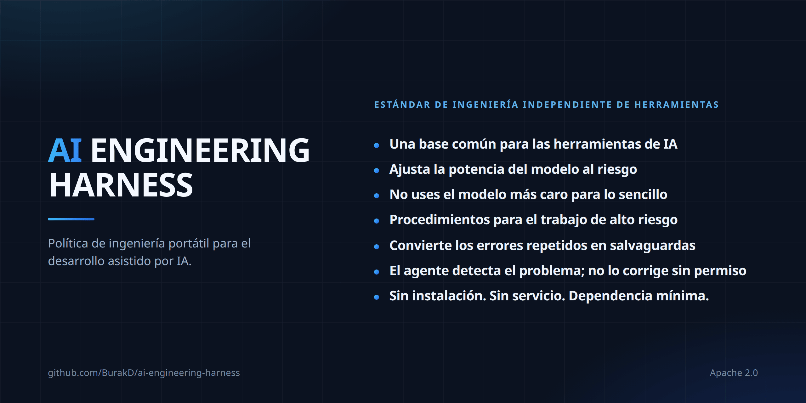

<!-- Based on README.md @ v2.1.0 -->
# AI Engineering Harness



Idiomas: [English](../README.md) · [Türkçe](README.tr.md) · Español · [Português (Brasil)](README.pt-BR.md) · [Deutsch](README.de.md) · [Français](README.fr.md) · [Русский](README.ru.md) · [简体中文](README.zh-CN.md) · [日本語](README.ja.md) · [한국어](README.ko.md) · [العربية](README.ar.md) · [हिन्दी](README.hi.md)

Una capa de políticas/contexto mínima e independiente del proveedor (vendor-neutral) para el desarrollo de software asistido por AI, junto con un pequeño conjunto de procedimientos reutilizables. No es un agent runtime (entorno de ejecución de agentes), un orchestrator (orquestador), un installer (instalador) ni un framework (marco de software).

## Qué obtienes

- Una única base de ingeniería entre herramientas. Cursor, Claude Code, Codex, Antigravity y Kiro leen el mismo contexto y las mismas restricciones del proyecto, por lo que cambiar de herramienta no implica volver a explicar el proyecto.
- La elección del modelo se vincula al riesgo, no a la costumbre. El trabajo se clasifica en capability tiers (niveles de capacidad) y empieza por el nivel suficiente más bajo. Es policy (política), no enforcement (imposición técnica): lo que realmente ahorre depende del runtime (entorno de ejecución) activo y de tu plan.
- Procedimientos preparados para los trabajos que más duelen cuando salen mal. Secret exposure (exposición de secretos), releases (publicaciones), dependency changes (cambios de dependencias), high-risk changes (cambios de alto riesgo) y recovery (recuperación) tienen cada uno un procedimiento compartido, y ningún procedimiento puede relajar un approval boundary (límite de aprobación).
- Discovery (descubrimiento) no es authorization (autorización). Si un agent (agente) detecta un problema fuera de su tarea, lo informa y espera una decisión en lugar de corregirlo por iniciativa propia.
- Fail closed (fallar de forma segura) en capabilities (capacidades). Un agente no debe afirmar que dispone de un model (modelo), subagent (subagente) o skill activation (activación de una habilidad) que el runtime activo no pueda proporcionar realmente.
- El context (contexto) se mantiene pequeño. Los procedimientos compartidos se cargan cuando una tarea coincide con ellos en lugar de llenar cada session (sesión).
- Poco lock-in (dependencia). Markdown en tu repository (repositorio), sin installer, runtime ni service (servicio). Adoption (instalación) y removal (eliminación) son procedimientos documentados, no una puerta de un solo sentido.

## Archivos

- `AGENTS.md` — base de ingeniería compartida always-on (siempre activa).
- `MODEL_ROUTING.md` — política estable de calidad/coste y capability tier (nivel de capacidad).
- `MODEL_CATALOG.md` — catálogo de runtime (entorno de ejecución) y modelos que cambia con el tiempo.
- `CLAUDE.md` — puente ligero de Claude Code hacia `AGENTS.md`.
- `skills/` — procedimientos procedentes de una fuente Harness-owned (propiedad del Harness), canonical (autorizada única) y on-demand (cargada bajo demanda).
- `i18n/` — resúmenes localizados de `README.md`.

## Rules (reglas) y skills (habilidades): cuatro capas

Rules es la orientación que permanece vigente; skills son procedimientos que entran en juego para tareas concretas.

| | Always-on (siempre activa) | On-demand (bajo demanda) |
| --- | --- | --- |
| Compartida | `AGENTS.md` + `MODEL_ROUTING.md` | `skills/` |
| Específica del proyecto | Mecanismo propio de rules/policy del proyecto | Skills propios del proyecto |

Harness no ofrece un directorio `rules/` separado: la canonical source (fuente autorizada única) de la capa compartida always-on ya es `AGENTS.md`, mientras que la política de model routing está en `MODEL_ROUTING.md`. Una segunda fuente always-on generaría duplicación y riesgo de contradicción.

Las reglas de dominio, la topología de entorno y deployment (despliegue), las preferencias de proveedor/modelo, el comportamiento del producto, las reglas de negocio y las rutas de infraestructura permanecen específicas del proyecto. Para decidir a qué capa pertenece una nueva guía, use el enfoque de elegir el safeguard (protección) duradero más pequeño del skill `continuous-improvement`.

## Skills (habilidades) compartidos

Skills son procedimientos específicos de tarea, no una always-on policy. Con progressive disclosure (revelación progresiva), normalmente solo es visible la discovery metadata (metadatos de descubrimiento); el cuerpo completo de `SKILL.md` se carga únicamente cuando la tarea coincide realmente.

La canonical source de los Harness-owned skills es `skills/` y el ownership marker (marcador de propiedad) es:

```yaml
metadata:
  ai-engineering-harness: "2.0.0"
```

Un skill con el mismo nombre que no lleve esta clave no es Harness-owned; no se sobrescribe durante adoption (instalación) ni update (actualización).

El conjunto v2 contiene 14 skills:

- `backup-and-recovery-review` — revisión de la preparación de backup (copia de seguridad), restore (restauración) y recovery (recuperación).
- `interface-qa` — validación de interfaces web, móvil, de escritorio, CLI y API.
- `calculation-model-validation` — validación de fórmulas y modelos de decisión.
- `change-review` — revisión de regresiones y riesgos en cambios terminados.
- `compatibility-and-rollout` — compatibilidad, migration (migración de datos/esquema), rollout (despliegue gradual) y rollback (reversión).
- `high-risk-change-review` — disciplina adicional para cambios de alto impacto.
- `delegation-strategy` — uso de delegation (delegación de tareas) y trabajo paralelo verificados.
- `dependency-change` — revisión de adición, eliminación y actualización de versión de dependency (dependencia).
- `documentation-sync` — mantener la documentación duradera sincronizada con la realidad.
- `environment-release-safety` — impacto de release (publicación) y deployment (despliegue) junto con seguridad de aprobación.
- `continuous-improvement` — convertir errores repetidos en safeguards (protecciones) duraderos.
- `root-cause-debug` — encontrar y demostrar la causa raíz en lugar del síntoma.
- `secret-exposure-response` — respuesta a filtraciones de secret (secreto) y credential (credencial).
- `cross-surface-consistency` — consistencia de comportamiento entre múltiples interfaces.

El conjunto compartido debe mantenerse aproximadamente en 20 skills o menos; los campos `description` deben tener 300 caracteres o menos.

Orden de precedencia: rules/policy específicos del proyecto > base compartida de `AGENTS.md` > skills compartidos. Un skill no puede relajar approval boundary (límite de aprobación), authorized scope (alcance autorizado), runtime capability (capacidad del entorno de ejecución) ni production/live safety (seguridad en producción/en vivo).

## Adoption (instalación) y update (actualización)

Los prompts de copiar/pegar se mantienen en una única canonical source y no se traducen:

- [Prompt de instalación (en inglés)](../README.md#copypaste-adoption-prompt)
- [Prompt de actualización (en inglés)](../README.md#copypaste-update-prompt)

Adoption determina los runtimes utilizados a partir de repository evidence (evidencia del repositorio); tener un CLI instalado no basta por sí solo. Las rutas de skills verificadas a nivel de proyecto son: `.agents/skills/` para Cursor, Antigravity y Codex; `.claude/skills/` para Claude Code; `.kiro/skills/` para Kiro. Cursor también puede leer `.claude/skills/`. Kiro descubre directamente `AGENTS.md` en la raíz del workspace (espacio de trabajo) y en subdirectorios, por lo que no se crea `.kiro/steering/` solo para duplicar la base del Harness. Los Kiro custom agents (agentes personalizados) normalmente heredan los default resources (recursos predeterminados), incluidos los workspace skills y `AGENTS.md`, pero `chat.disableInheritingDefaultResources` puede desactivar esa herencia. Si está desactivada, no se afirma native activation (activación nativa) sin un skill resource (recurso de habilidad) explícito como `skill://.kiro/skills/**/SKILL.md`, y no se modifican archivos de `.kiro/agents/` sin aprobación humana. Si un único root (directorio raíz) verificado cubre todos los runtimes utilizados, se usa una sola copia. Si no puede verificarse la native activation, `harness/skills/` se usa como neutral fallback (alternativa neutral) y no se afirma que haya tenido lugar.

Antes de escribir cualquier skill, todos los nombres canonical se revisan en todos los roots de destino para detectar collision (colisión de nombres). Si va a cambiarse un skill managed (gestionado), se realiza fuera del repository un backup byte-for-byte (copia de seguridad byte por byte). Las copias Harness-owned se mantienen verbatim (idénticas) a la fuente canonical. Update no mueve la ubicación existente del skill; un managed skill eliminado upstream (en la fuente superior) no se borra automáticamente y se reporta como orphaned (ausente de la fuente).

## Eliminación y pruebas

No hay un uninstaller (desinstalador) automático. Solo se eliminan los managed skills que llevan el marcador de propiedad `metadata.ai-engineering-harness`; no se tocan los skills ni rules específicos del proyecto. Véase [Eliminar los skills compartidos (en inglés)](../README.md#remove-the-shared-skills).

Si no puede verificarse la native activation durante la prueba de instalación, el agent no debe afirmar que el skill está activo. En una tarea no relacionada, los cuerpos de los skills no deben cargarse en el context (contexto); solo debe ser visible la discovery metadata. Véase [Probar la instalación (en inglés)](../README.md#how-to-test-an-installation).

Los archivos `SKILL.md` no se traducen; se conserva una única copia inglesa canonical. Para mantenimiento detallado, comportamiento de adoption/update y límites de alcance, el [README en inglés](../README.md) es la fuente principal.
