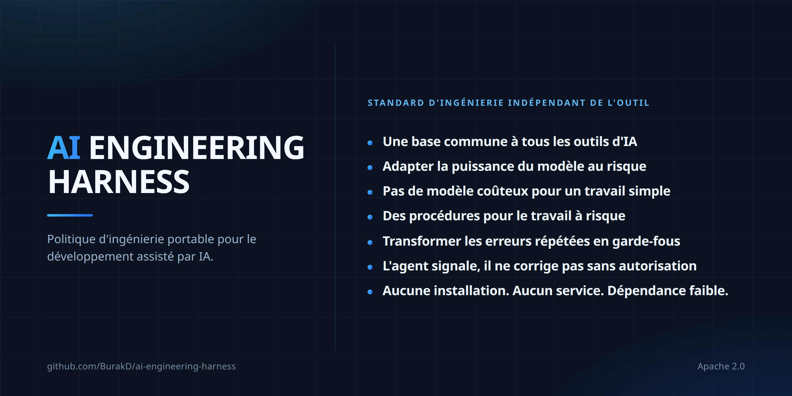

<!-- Based on README.md @ v2.2.0 -->
# AI Engineering Harness



Langues : [English](../README.md) · [Türkçe](README.tr.md) · [Español](README.es.md) · [Português (Brasil)](README.pt-BR.md) · [Deutsch](README.de.md) · Français · [Русский](README.ru.md) · [简体中文](README.zh-CN.md) · [日本語](README.ja.md) · [한국어](README.ko.md) · [العربية](README.ar.md) · [हिन्दी](README.hi.md)

Une couche minimale de politiques/contexte, indépendante du fournisseur (vendor-neutral), pour le développement logiciel assisté par AI, accompagnée d’un petit ensemble de procédures réutilisables. Ce n’est ni un agent runtime (environnement d’exécution d’agents), ni un orchestrator (orchestrateur), ni un installer (outil d’installation), ni un framework (cadre logiciel).

## Ce que vous obtenez

- Une base d’ingénierie unique entre les outils. Cursor, Claude Code, Codex, Antigravity et Kiro lisent le même contexte et les mêmes contraintes de projet ; changer d’outil ne signifie donc pas réexpliquer le projet.
- Le choix du modèle est lié au risque, pas à l’habitude. Le travail est classé en capability tiers (niveaux de capacité) et commence au niveau suffisant le plus bas. Il s’agit d’une policy (politique), pas d’un enforcement (mécanisme d’imposition) : ce que cela permet réellement d’économiser dépend du runtime (environnement d’exécution) actif et de votre forfait.
- Des procédures prêtes pour les travaux qui coûtent cher lorsqu’ils tournent mal. Secret exposure (exposition de secrets), releases (publications), dependency changes (changements de dépendances), high-risk changes (changements à haut risque) et recovery (récupération) disposent chacun d’une procédure partagée, et aucune procédure ne peut assouplir une approval boundary (limite d’approbation).
- Discovery (découverte) n’est pas authorization (autorisation). Si un agent (agent) détecte un problème hors de sa tâche, il le signale et attend une décision au lieu de le corriger de sa propre initiative.
- Fail closed (échouer de manière sûre) pour les capabilities (capacités). Un agent ne doit pas prétendre disposer d’un model (modèle), d’un subagent (sous-agent) ou d’une skill activation (activation de compétence) que le runtime actif ne peut pas réellement fournir.
- Le context (contexte) reste réduit. Les procédures partagées se chargent lorsqu’une tâche leur correspond au lieu de remplir chaque session (session).
- Faible lock-in (enfermement). Du Markdown dans votre repository (dépôt), sans installer, runtime ni service (service). Adoption (installation) et removal (suppression) sont des procédures documentées, pas une porte à sens unique.

## Fichiers

- `AGENTS.md` — base d’ingénierie partagée always-on (toujours active).
- `MODEL_ROUTING.md` — politique stable qualité/coût et capability tier (niveau de capacité).
- `MODEL_CATALOG.md` — catalogue de runtime (environnement d’exécution) et de modèles évoluant dans le temps.
- `CLAUDE.md` — passerelle légère de Claude Code vers `AGENTS.md`.
- `skills/` — procédures provenant d’une source Harness-owned (appartenant au Harness), canonical (unique et faisant autorité), on-demand (chargée à la demande).
- `i18n/` — résumés localisés de `README.md`.

## Rules (règles) et skills (compétences) : quatre couches

Rules désigne les consignes qui restent applicables ; skills désigne les procédures qui interviennent pour des tâches précises.

| | Always-on (toujours active) | On-demand (à la demande) |
| --- | --- | --- |
| Partagée | `AGENTS.md` + `MODEL_ROUTING.md` | `skills/` |
| Spécifique au projet | Mécanisme rules/policy propre au projet | Skills propres au projet |

Harness ne fournit pas de répertoire `rules/` séparé : la canonical source (source unique faisant autorité) de la couche partagée always-on est déjà `AGENTS.md`, tandis que la politique de model routing se trouve dans `MODEL_ROUTING.md`. Une seconde source always-on créerait duplication et risque de contradiction.

Les règles de domaine, la topologie d’environnement et de deployment (déploiement), les préférences fournisseur/modèle, le comportement produit, les règles métier et les chemins d’infrastructure restent spécifiques au projet. Pour décider à quelle couche appartient une nouvelle consigne, utilisez l’approche consistant à choisir le plus petit safeguard (protection) durable du skill `continuous-improvement`.

## Skills (compétences) partagés

Skills désigne des procédures propres à une tâche, pas une always-on policy. Avec progressive disclosure (révélation progressive), seule la discovery metadata (métadonnée de découverte) est normalement visible ; le corps complet de `SKILL.md` n’est chargé que lorsque la tâche correspond réellement.

La canonical source des Harness-owned skills est `skills/` et l’ownership marker (marqueur de propriété) est :

```yaml
metadata:
  ai-engineering-harness: "2.0.0"
```

Un skill de même nom qui ne porte pas cette clé n’est pas Harness-owned ; il n’est pas écrasé pendant adoption (installation) ou update (mise à jour).

Le jeu v2 contient 15 skills :

- `backup-and-recovery-review` — examen de la préparation de backup (sauvegarde), restore (restauration) et recovery (récupération).
- `interface-qa` — validation des interfaces web, mobile, bureau, CLI et API.
- `calculation-model-validation` — validation de formules et modèles de décision.
- `change-review` — examen des régressions et risques des changements terminés.
- `compatibility-and-rollout` — compatibilité, migration (migration de données/schéma), rollout (déploiement progressif) et rollback (retour arrière).
- `high-risk-change-review` — discipline supplémentaire pour les changements à fort impact.
- `delegation-strategy` — utilisation vérifiée de delegation (délégation de tâches) et du travail parallèle.
- `dependency-change` — examen de l’ajout, de la suppression et de la montée de version d’une dependency (dépendance).
- `documentation-sync` — maintien de la documentation durable synchronisée avec la réalité.
- `environment-release-safety` — impact de release (publication) et deployment (déploiement), avec sécurité d’approbation.
- `automation-cost-control` — contrôle le coût de compute mesuré de l’automatisation à partir des dépenses réelles, de l’executor (exécuteur) suffisant le moins coûteux, de limites de durée et de la vérification que les conditions de coût ne suppriment pas silencieusement un travail requis.
- `continuous-improvement` — transformation des erreurs répétées en safeguards (protections) durables.
- `root-cause-debug` — recherche et preuve de la cause racine plutôt que du symptôme.
- `secret-exposure-response` — réponse aux fuites de secret (secret) et credential (identifiant).
- `cross-surface-consistency` — cohérence du comportement entre plusieurs interfaces.

Le jeu partagé doit rester autour de 20 skills ou moins ; les champs `description` doivent contenir 300 caractères ou moins.

Ordre de priorité : rules/policy propres au projet > base partagée `AGENTS.md` > skills partagés. Un skill ne peut assouplir approval boundary (limite d’approbation), authorized scope (périmètre autorisé), runtime capability (capacité de l’environnement d’exécution) ni production/live safety (sécurité en production/en direct).

## Adoption (installation) et update (mise à jour)

Les prompts copier/coller restent dans une seule canonical source et ne sont pas traduits :

- [Prompt d’installation (en anglais)](../README.md#copypaste-adoption-prompt)
- [Prompt de mise à jour (en anglais)](../README.md#copypaste-update-prompt)

Adoption détermine les runtimes utilisés à partir de repository evidence (preuves du dépôt) ; la présence d’un CLI installé ne suffit pas à elle seule. Les chemins de skills vérifiés au niveau du projet sont : `.agents/skills/` pour Cursor, Antigravity et Codex ; `.claude/skills/` pour Claude Code ; `.kiro/skills/` pour Kiro. Cursor peut aussi lire `.claude/skills/`. Kiro découvre directement `AGENTS.md` à la racine du workspace (espace de travail) et dans ses sous-répertoires ; `.kiro/steering/` n’est donc pas créé simplement pour dupliquer la base du Harness. Les Kiro custom agents (agents personnalisés) héritent normalement des default resources (ressources par défaut), dont les workspace skills et `AGENTS.md`, mais le réglage `chat.disableInheritingDefaultResources` peut désactiver cet héritage. Dans ce cas, aucune native activation (activation native) n’est revendiquée sans skill resource (ressource de compétence) explicite telle que `skill://.kiro/skills/**/SKILL.md`, et les fichiers sous `.kiro/agents/` ne sont pas modifiés sans approbation humaine. Si un seul root (répertoire racine) vérifié couvre tous les runtimes utilisés, une seule copie est utilisée. Si la native activation ne peut pas être vérifiée, `harness/skills/` sert de neutral fallback (solution de repli neutre) et aucune native activation n’est revendiquée.

Avant d’écrire un skill, tous les noms canonical sont contrôlés dans tous les roots cibles pour détecter une collision (collision de noms). Si un skill managed (géré) doit changer, une sauvegarde byte-for-byte (octet par octet) est réalisée hors du repository. Les copies Harness-owned restent verbatim (strictement identiques) à la source canonical. Update ne déplace pas l’emplacement existant du skill ; un managed skill supprimé upstream (dans la source amont) n’est pas effacé automatiquement et est signalé comme orphaned (absent de la source).

## Suppression et tests

Il n’existe pas d’uninstaller (outil de désinstallation) automatique. Seuls les managed skills portant le marqueur de propriété `metadata.ai-engineering-harness` sont supprimés ; les skills et rules propres au projet ne sont pas modifiés. Voir [Supprimer les skills partagés (en anglais)](../README.md#remove-the-shared-skills).

Si la native activation ne peut pas être vérifiée pendant le test d’installation, l’agent ne doit pas prétendre que le skill est actif. Pour une tâche sans rapport, les corps de skills ne doivent pas être chargés dans le context (contexte) ; seule la discovery metadata doit rester visible. Voir [Tester l’installation (en anglais)](../README.md#how-to-test-an-installation).

Les fichiers `SKILL.md` ne sont pas traduits ; une seule copie anglaise canonical est conservée. Pour la maintenance détaillée, le comportement adoption/update et les limites de périmètre, le [`README.md` anglais](../README.md) fait foi.
