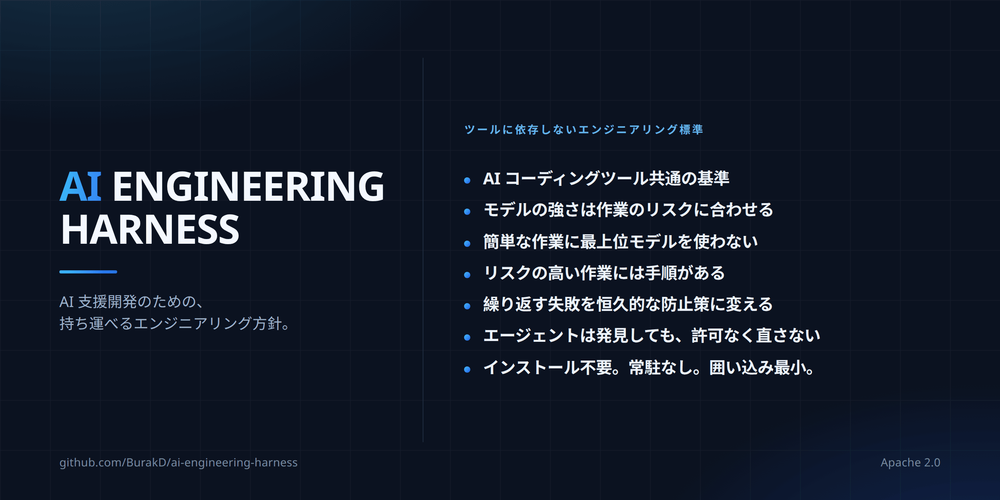

<!-- Based on README.md @ v2.0.4 -->
# AI Engineering Harness



言語: [English](../README.md) · [Türkçe](README.tr.md) · [Español](README.es.md) · [Português (Brasil)](README.pt-BR.md) · [Deutsch](README.de.md) · [Français](README.fr.md) · [Русский](README.ru.md) · [简体中文](README.zh-CN.md) · 日本語 · [한국어](README.ko.md) · [العربية](README.ar.md) · [हिन्दी](README.hi.md)

AI 支援ソフトウェア開発向けの、最小かつベンダー非依存（vendor-neutral）のポリシー/コンテキスト層と、小さな再利用可能な手順群です。agent runtime（エージェント実行環境）、orchestrator（オーケストレーター）、installer（インストール機構）、framework（ソフトウェア基盤）ではありません。

## 得られるもの

- ツールをまたいだ 1 つの engineering baseline（エンジニアリング基盤）。Cursor、Claude Code、Codex、Antigravity は同じ project context（プロジェクトコンテキスト）と constraints（制約）を読むため、ツールを切り替えてもプロジェクトを説明し直す必要がありません。
- モデル選択は習慣ではなくリスクに結び付きます。作業は capability tiers（能力レベル）に分類され、必要十分な最も低いレベルから始めます。これは enforcement（強制）ではなく policy（ポリシー）です。実際の節約効果は active runtime（現在の実行環境）と利用プランに依存します。
- 失敗時の影響が大きい作業向けの準備済み手順。Secret exposure（シークレット漏えい）、releases（リリース）、dependency changes（依存関係の変更）、high-risk changes（高リスク変更）、recovery（復旧）にはそれぞれ共有手順があり、どの手順も approval boundary（承認境界）を緩めることはできません。
- Discovery（発見）は authorization（権限付与）ではありません。Agent（エージェント）が自分のタスク外の問題に気づいた場合、自発的に修正するのではなく報告し、判断を待ちます。
- Capabilities（能力）は fail closed（検証できなければ利用不可として扱う）。Agent は active runtime が実際には提供できない model（モデル）、subagent（サブエージェント）、skill activation（スキル有効化）を利用できると主張してはいけません。
- Context（コンテキスト）は小さく保たれます。共有手順はすべての session（セッション）を埋めるのではなく、タスクが一致したときに読み込まれます。
- Low lock-in（低い囲い込み）。Repository（リポジトリ）内の Markdown であり、installer、runtime、service（サービス）はありません。Adoption（導入）と removal（削除）は一方通行ではなく、文書化された手順です。

## ファイル

- `AGENTS.md` — 共有の always-on（常時有効）エンジニアリング基盤。
- `MODEL_ROUTING.md` — 安定した品質/コストと capability tier（能力レベル）のポリシー。
- `MODEL_CATALOG.md` — 時間とともに変化する runtime（実行環境）とモデルのカタログ。
- `CLAUDE.md` — Claude Code から `AGENTS.md` への軽量な橋渡し。
- `skills/` — Harness-owned（Harness 所有）、canonical（唯一の正本）なソースから提供され、on-demand（必要時に読み込まれる）手順。
- `i18n/` — `README.md` のローカライズ要約。

## Rules（ルール）と skills（スキル）：4つの層

Rules は継続的に有効な指針、skills は特定のタスクで有効になる手順です。

| | Always-on（常時有効） | On-demand（必要時） |
| --- | --- | --- |
| 共有 | `AGENTS.md` + `MODEL_ROUTING.md` | `skills/` |
| プロジェクト固有 | プロジェクト独自の rules/policy 機構 | プロジェクト独自の skills |

Harness は別の `rules/` ディレクトリを提供しません。共有 always-on ルール層の canonical source（唯一の正本）はすでに `AGENTS.md` にあり、モデルルーティングポリシーは `MODEL_ROUTING.md` にあります。2つ目の always-on ソースは重複と矛盾のリスクを生みます。

ドメインルール、環境と deployment（デプロイ）の構成、ベンダー/モデル設定、製品動作、ビジネスルール、インフラパスはプロジェクト固有のままにします。新しい指針をどの層に置くかは、`continuous-improvement` skill の最小で永続的な safeguard（保護策）を選ぶ考え方で判断します。

## 共有 skills（スキル）

Skills はタスク固有の手順であり、always-on policy ではありません。progressive disclosure（段階的表示）では通常、discovery metadata（検出用メタデータ）のみが見え、完全な `SKILL.md` 本文はタスクが本当に一致したときだけ読み込まれます。

Harness-owned skills の canonical source は `skills/` で、ownership marker（所有者マーカー）は次のとおりです。

```yaml
metadata:
  ai-engineering-harness: "2.0.0"
```

同名の skill にこのキーがなければ Harness-owned ではなく、adoption（導入）や update（更新）で上書きされません。

v2 は 14 個の skills を含みます。

- `backup-and-recovery-review` — backup（バックアップ）、restore（復元）、recovery（復旧）の準備状況を確認。
- `interface-qa` — web、mobile、desktop、CLI、API インターフェースを検証。
- `calculation-model-validation` — 数式と意思決定モデルを検証。
- `change-review` — 完了した変更の回帰とリスクを確認。
- `compatibility-and-rollout` — 互換性、migration（データ/スキーマ移行）、rollout（段階的リリース）、rollback（ロールバック）。
- `high-risk-change-review` — 影響の大きい変更に追加の規律を適用。
- `delegation-strategy` — 検証済みの delegation（タスク委任）と並列作業を利用。
- `dependency-change` — dependency（依存関係）の追加・削除・バージョン更新を確認。
- `documentation-sync` — 長期的な文書を実態と同期。
- `environment-release-safety` — release（リリース）と deployment（デプロイ）の影響、および承認の安全性を確認。
- `continuous-improvement` — 繰り返す失敗を永続的な safeguards（保護策）に変換。
- `root-cause-debug` — 症状ではなく根本原因を特定し、証明。
- `secret-exposure-response` — secret（シークレット）と credential（認証情報）の漏えいに対応。
- `cross-surface-consistency` — 複数のインターフェースで動作の一貫性を維持。

共有セットはおおむね 20 skills 以下に保ち、`description` フィールドは 300 文字以下にします。

優先順位：プロジェクト固有の rules/policy > 共有 `AGENTS.md` 基盤 > 共有 skills。Skill は approval boundary（承認境界）、authorized scope（許可された範囲）、runtime capability（実行環境の能力）、production/live safety（本番/稼働中環境の安全性）を弱めてはいけません。

## Adoption（導入）と update（更新）

コピー/貼り付け用プロンプトは 1 つの canonical source に置き、翻訳しません。

- [導入プロンプト（英語）](../README.md#copypaste-adoption-prompt)
- [更新プロンプト（英語）](../README.md#copypaste-update-prompt)

Adoption は repository evidence（リポジトリ内の証拠）から使用中の runtimes を判定します。マシンに CLI が入っているだけでは十分ではありません。検証済みのプロジェクトレベルの skill パスは、Cursor、Antigravity、Codex が `.agents/skills/`、Claude Code が `.claude/skills/` です。Cursor は `.claude/skills/` も読めます。1 つの検証済み root（ルートディレクトリ）が使用中の全 runtimes をカバーするなら、コピーは 1 つだけ使います。native activation（ネイティブ有効化）を検証できない場合は `harness/skills/` を neutral fallback（中立的な代替先）として使い、native activation 済みとは主張しません。

Skill を書き込む前に、すべての canonical 名をすべての対象 roots で collision（名前衝突）確認します。変更する managed（管理対象）skill がある場合は、repository 外に byte-for-byte（バイト単位で完全一致）のバックアップを作ります。Harness-owned のコピーは canonical ソースと verbatim（完全一致）に保ちます。Update は既存の skill 配置を移動しません。upstream（上流ソース）から削除された managed skill も自動削除せず、orphaned（上流に存在しない状態）として報告します。

## 削除とテスト

自動 uninstaller（アンインストール機構）はありません。`metadata.ai-engineering-harness` の所有者マーカーを持つ managed skills だけを削除し、プロジェクト固有の skills と rules は変更しません。詳しくは [共有 skills の削除（英語）](../README.md#remove-the-shared-skills) を参照してください。

導入テストで native activation を検証できない場合、agent は skill が有効だと主張してはいけません。無関係なタスクでは skill 本文を context（コンテキスト）に読み込まず、discovery metadata のみが見える状態にします。詳しくは [導入のテスト（英語）](../README.md#how-to-test-an-installation) を参照してください。

`SKILL.md` は翻訳せず、canonical な英語コピーを 1 つだけ維持します。詳細な保守、adoption/update の動作、範囲境界は [英語の `README.md`](../README.md) を基準にします。
