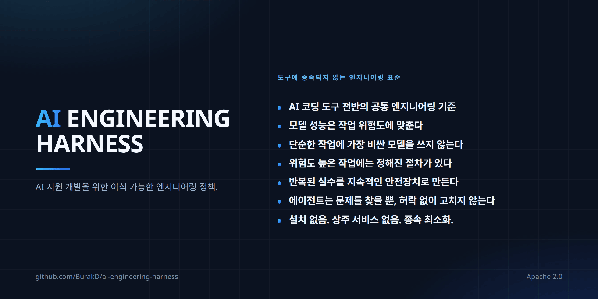

<!-- Based on README.md @ v2.2.0 -->
# AI Engineering Harness



언어: [English](../README.md) · [Türkçe](README.tr.md) · [Español](README.es.md) · [Português (Brasil)](README.pt-BR.md) · [Deutsch](README.de.md) · [Français](README.fr.md) · [Русский](README.ru.md) · [简体中文](README.zh-CN.md) · [日本語](README.ja.md) · 한국어 · [العربية](README.ar.md) · [हिन्दी](README.hi.md)

AI 지원 소프트웨어 개발을 위한 최소한의 vendor-neutral(벤더 중립) 정책/컨텍스트 레이어와 작고 재사용 가능한 절차 집합입니다. agent runtime(에이전트 실행 환경), orchestrator(오케스트레이션 시스템), installer(설치 도구), framework(소프트웨어 프레임워크)가 아닙니다.

## 무엇을 얻을 수 있나

- 도구 전반에 하나의 engineering baseline(엔지니어링 기준). Cursor, Claude Code, Codex, Antigravity, Kiro가 같은 project context(프로젝트 컨텍스트)와 constraints(제약)를 읽으므로 도구를 바꿔도 프로젝트를 다시 설명할 필요가 없습니다.
- 모델 선택은 습관이 아니라 위험에 연결됩니다. 작업은 capability tiers(역량 수준)로 분류되고 충분한 가장 낮은 수준에서 시작합니다. 이는 enforcement(강제 적용)가 아니라 policy(정책)이며, 실제 절감 효과는 active runtime(현재 실행 환경)과 사용 중인 요금제에 달려 있습니다.
- 잘못됐을 때 피해가 큰 작업을 위한 준비된 절차. Secret exposure(비밀값 노출), releases(릴리스), dependency changes(의존성 변경), high-risk changes(고위험 변경), recovery(복구)에는 각각 공유 절차가 있으며 어떤 절차도 approval boundary(승인 경계)를 완화할 수 없습니다.
- Discovery(발견)는 authorization(권한 부여)이 아닙니다. Agent(에이전트)가 자신의 작업 범위 밖에서 문제를 발견하면 스스로 고치지 않고 보고한 뒤 결정을 기다립니다.
- Capabilities(역량)는 fail closed(검증되지 않으면 사용할 수 없는 것으로 처리)합니다. Agent는 active runtime이 실제로 제공할 수 없는 model(모델), subagent(하위 에이전트), skill activation(스킬 활성화)을 사용할 수 있다고 주장해서는 안 됩니다.
- Context(컨텍스트)는 작게 유지됩니다. 공유 절차는 모든 session(세션)을 채우는 대신 작업과 일치할 때만 로드됩니다.
- Low lock-in(낮은 종속성). Repository(저장소) 안의 Markdown이며 installer, runtime, service(서비스)가 없습니다. Adoption(도입)과 removal(제거)은 일방통행이 아니라 문서화된 절차입니다.

## 파일

- `AGENTS.md` — 공유 always-on(항상 활성) 엔지니어링 기준.
- `MODEL_ROUTING.md` — 안정적인 품질/비용 및 capability tier(역량 수준) 정책.
- `MODEL_CATALOG.md` — 시간에 따라 바뀌는 runtime(실행 환경) 및 모델 카탈로그.
- `CLAUDE.md` — Claude Code에서 `AGENTS.md`로 연결하는 가벼운 브리지.
- `skills/` — Harness-owned(Harness 소유), canonical(유일한 기준) 소스에서 제공되며 on-demand(필요할 때 로드되는) 절차.
- `i18n/` — `README.md` 현지화 요약.

## Rules(규칙)와 skills(스킬): 네 개 레이어

Rules는 계속 적용되는 지침이고, skills는 특정 작업에서 활성화되는 절차입니다.

| | Always-on(항상 활성) | On-demand(필요 시) |
| --- | --- | --- |
| 공유 | `AGENTS.md` + `MODEL_ROUTING.md` | `skills/` |
| 프로젝트 전용 | 프로젝트 자체 rules/policy 메커니즘 | 프로젝트 자체 skills |

Harness는 별도의 `rules/` 디렉터리를 제공하지 않습니다. 공유 always-on 규칙 레이어의 canonical source(유일한 기준 원본)는 이미 `AGENTS.md`이고, 모델 라우팅 정책은 `MODEL_ROUTING.md`에 있습니다. 두 번째 always-on 소스는 중복과 충돌 위험을 만듭니다.

도메인 규칙, 환경 및 deployment(배포) 토폴로지, 벤더/모델 선호, 제품 동작, 비즈니스 규칙, 인프라 경로는 프로젝트 전용으로 유지합니다. 새 지침이 어느 레이어에 속해야 하는지는 `continuous-improvement` skill의 가장 작은 지속 가능 safeguard(보호 장치)를 선택하는 방식으로 결정합니다.

## 공유 skills(스킬)

Skills는 작업별 절차이며 always-on policy가 아닙니다. progressive disclosure(점진적 표시)에서는 일반적으로 discovery metadata(탐색 메타데이터)만 보이고, 전체 `SKILL.md` 본문은 작업이 실제로 일치할 때만 로드됩니다.

Harness-owned skills의 canonical source는 `skills/`이며 ownership marker(소유권 표시)는 다음과 같습니다.

```yaml
metadata:
  ai-engineering-harness: "2.0.0"
```

같은 이름의 skill이 이 키를 갖고 있지 않으면 Harness-owned가 아니며 adoption(도입)이나 update(업데이트) 중 덮어쓰지 않습니다.

v2에는 15개 skills가 있습니다.

- `backup-and-recovery-review` — backup(백업), restore(복원), recovery(복구) 준비 상태 검토.
- `interface-qa` — web, mobile, desktop, CLI, API 인터페이스 검증.
- `calculation-model-validation` — 수식과 의사결정 모델 검증.
- `change-review` — 완료된 변경의 회귀 및 위험 검토.
- `compatibility-and-rollout` — 호환성, migration(데이터/스키마 마이그레이션), rollout(단계적 배포), rollback(되돌리기).
- `high-risk-change-review` — 영향이 큰 변경에 대한 추가 규율.
- `delegation-strategy` — 검증된 delegation(작업 위임)과 병렬 작업 사용.
- `dependency-change` — dependency(의존성) 추가, 삭제, 버전 상향 검토.
- `documentation-sync` — 장기 문서를 실제 상태와 동기화.
- `environment-release-safety` — release(릴리스)와 deployment(배포)의 영향 및 승인 안전성.
- `automation-cost-control` — 실제 지출을 기준으로 자동화의 metered compute(종량제 연산) 비용을 관리하고, 가장 저렴하면서 충분한 executor(실행기), 실행 시간 한도, 비용 조건이 필수 작업을 조용히 누락하지 않는지 검증합니다.
- `continuous-improvement` — 반복되는 오류를 지속 가능한 safeguards(보호 장치)로 전환.
- `root-cause-debug` — 증상이 아니라 근본 원인을 찾아 입증.
- `secret-exposure-response` — secret(비밀값)과 credential(인증 정보) 유출 대응.
- `cross-surface-consistency` — 여러 인터페이스에서 동작 일관성 유지.

공유 집합은 대략 20 skills 이하로 유지하며 `description` 필드는 300자 이하여야 합니다.

우선순위: 프로젝트 전용 rules/policy > 공유 `AGENTS.md` 기준 > 공유 skills. Skill은 approval boundary(승인 경계), authorized scope(허용 범위), runtime capability(실행 환경 역량), production/live safety(운영/라이브 안전성)를 약화할 수 없습니다.

## Adoption(도입)과 update(업데이트)

복사/붙여넣기 프롬프트는 하나의 canonical source에만 두고 번역하지 않습니다.

- [도입 프롬프트(영어)](../README.md#copypaste-adoption-prompt)
- [업데이트 프롬프트(영어)](../README.md#copypaste-update-prompt)

Adoption은 repository evidence(저장소의 근거)를 통해 사용 중인 runtimes를 판단합니다. 머신에 CLI가 설치되어 있다는 사실만으로는 충분하지 않습니다. 검증된 프로젝트 수준 skill 경로는 다음과 같습니다: Cursor, Antigravity, Codex는 `.agents/skills/`, Claude Code는 `.claude/skills/`, Kiro는 `.kiro/skills/`. Cursor는 `.claude/skills/`도 읽을 수 있습니다. Kiro는 workspace root(워크스페이스 루트)와 하위 디렉터리의 `AGENTS.md`를 직접 탐색하므로 Harness 기준을 복제하기 위해서만 `.kiro/steering/`을 만들지 않습니다. Kiro custom agents(사용자 지정 에이전트)는 일반적으로 workspace skills와 `AGENTS.md`를 포함한 default resources(기본 리소스)를 상속하지만 `chat.disableInheritingDefaultResources` 설정으로 이 상속을 끌 수 있습니다. 상속이 꺼진 경우 `skill://.kiro/skills/**/SKILL.md` 같은 명시적 skill resource(스킬 리소스)가 없으면 native activation(네이티브 활성화)을 주장하지 않으며 사람의 승인 없이 `.kiro/agents/` 파일을 변경하지 않습니다. 하나의 검증된 root(루트 디렉터리)가 사용 중인 모든 runtimes를 포함하면 한 복사본만 사용합니다. native activation을 검증할 수 없으면 `harness/skills/`를 neutral fallback(중립 대안)으로 사용하고 native activation이 되었다고 주장하지 않습니다.

어떤 skill도 쓰기 전에 모든 canonical 이름을 모든 대상 roots에서 collision(이름 충돌) 여부로 검사합니다. 변경할 managed(관리 대상) skill이 있으면 repository 밖에 byte-for-byte(바이트 단위 완전 일치) 백업을 만듭니다. Harness-owned 복사본은 canonical 소스와 verbatim(완전 동일) 상태를 유지합니다. Update는 기존 skill 배치를 이동하지 않습니다. upstream(상위 원본)에서 제거된 managed skill도 자동 삭제하지 않고 orphaned(상위 원본에 없는 상태)로 보고합니다.

## 제거와 테스트

자동 uninstaller(제거 도구)는 없습니다. `metadata.ai-engineering-harness` 소유권 표시를 가진 managed skills만 제거하며 프로젝트 전용 skills와 rules는 건드리지 않습니다. [공유 skills 제거(영어)](../README.md#remove-the-shared-skills)를 참고하세요.

도입 테스트에서 native activation을 검증할 수 없다면 agent는 skill이 활성이라고 주장해서는 안 됩니다. 관련 없는 작업에서는 skill 본문을 context(컨텍스트)에 로드하지 않고 discovery metadata만 보여야 합니다. [도입 테스트(영어)](../README.md#how-to-test-an-installation)를 참고하세요.

`SKILL.md` 파일은 번역하지 않고 canonical 영어 복사본 하나만 유지합니다. 자세한 유지보수, adoption/update 동작, 범위 경계는 [영어 `README.md`](../README.md)를 기준으로 합니다.
