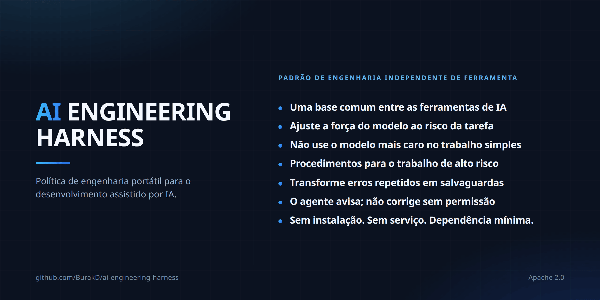

<!-- Based on README.md @ v2.0.4 -->
# AI Engineering Harness



Idiomas: [English](../README.md) · [Türkçe](README.tr.md) · [Español](README.es.md) · Português (Brasil) · [Deutsch](README.de.md) · [Français](README.fr.md) · [Русский](README.ru.md) · [简体中文](README.zh-CN.md) · [日本語](README.ja.md) · [한국어](README.ko.md) · [العربية](README.ar.md) · [हिन्दी](README.hi.md)

Uma camada mínima e independente de fornecedor (vendor-neutral) de políticas/contexto para desenvolvimento de software assistido por AI, junto com um pequeno conjunto de procedimentos reutilizáveis. Não é um agent runtime (ambiente de execução de agentes), um orchestrator (orquestrador), um installer (instalador) nem um framework (arcabouço de software).

## O que você obtém

- Uma única base de engenharia entre ferramentas. Cursor, Claude Code, Codex e Antigravity leem o mesmo contexto e as mesmas restrições do projeto, então trocar de ferramenta não significa explicar o projeto novamente.
- A escolha do modelo é ligada ao risco, não ao hábito. O trabalho é classificado em capability tiers (níveis de capacidade) e começa pelo menor nível suficiente. Isso é policy (política), não enforcement (imposição técnica): o que realmente economiza depende do runtime (ambiente de execução) ativo e do seu plano.
- Procedimentos prontos para os trabalhos que mais doem quando dão errado. Secret exposure (exposição de segredos), releases (publicações), dependency changes (mudanças de dependências), high-risk changes (mudanças de alto risco) e recovery (recuperação) têm cada um um procedimento compartilhado, e nenhum procedimento pode afrouxar um approval boundary (limite de aprovação).
- Discovery (descoberta) não é authorization (autorização). Se um agent (agente) perceber um problema fora da tarefa, ele o reporta e espera uma decisão em vez de corrigi-lo por iniciativa própria.
- Fail closed (falhar de forma segura) em capabilities (capacidades). Um agente não deve afirmar que existe um model (modelo), subagent (subagente) ou skill activation (ativação de habilidade) que o runtime ativo não possa fornecer de fato.
- O context (contexto) permanece pequeno. Os procedimentos compartilhados são carregados quando uma tarefa corresponde a eles, em vez de preencher cada session (sessão).
- Baixo lock-in (aprisionamento). Markdown no seu repository (repositório), sem installer, runtime ou service (serviço). Adoption (instalação) e removal (remoção) são procedimentos documentados, não uma porta de mão única.

## Arquivos

- `AGENTS.md` — base compartilhada de engenharia always-on (sempre ativa).
- `MODEL_ROUTING.md` — política estável de qualidade/custo e capability tier (nível de capacidade).
- `MODEL_CATALOG.md` — catálogo de runtime (ambiente de execução) e modelos que muda com o tempo.
- `CLAUDE.md` — ponte leve do Claude Code para `AGENTS.md`.
- `skills/` — procedimentos vindos de uma fonte Harness-owned (pertencente ao Harness), canonical (única autorizada) e on-demand (carregada sob demanda).
- `i18n/` — resumos localizados de `README.md`.

## Rules (regras) e skills (habilidades): quatro camadas

Rules é a orientação que permanece válida; skills são procedimentos acionados em tarefas específicas.

| | Always-on (sempre ativa) | On-demand (sob demanda) |
| --- | --- | --- |
| Compartilhada | `AGENTS.md` + `MODEL_ROUTING.md` | `skills/` |
| Específica do projeto | Mecanismo próprio de rules/policy do projeto | Skills próprios do projeto |

Harness não oferece um diretório `rules/` separado: a canonical source (fonte autorizada única) da camada compartilhada always-on já é `AGENTS.md`, enquanto a política de model routing está em `MODEL_ROUTING.md`. Uma segunda fonte always-on criaria duplicação e risco de conflito.

Regras de domínio, topologia de ambiente e deployment (implantação), preferências de fornecedor/modelo, comportamento do produto, regras de negócio e caminhos de infraestrutura permanecem específicos do projeto. Para decidir a qual camada pertence uma nova orientação, use a abordagem de escolher o menor safeguard (proteção) durável do skill `continuous-improvement`.

## Skills (habilidades) compartilhados

Skills são procedimentos específicos de tarefa, não uma always-on policy. Com progressive disclosure (revelação progressiva), normalmente apenas a discovery metadata (metadados de descoberta) fica visível; o corpo completo de `SKILL.md` só é carregado quando a tarefa realmente corresponde.

A canonical source dos Harness-owned skills é `skills/` e o ownership marker (marcador de propriedade) é:

```yaml
metadata:
  ai-engineering-harness: "2.0.0"
```

Um skill com o mesmo nome sem essa chave não é Harness-owned; não é sobrescrito durante adoption (instalação) nem update (atualização).

O conjunto v2 contém 14 skills:

- `backup-and-recovery-review` — revisão da prontidão de backup (cópia de segurança), restore (restauração) e recovery (recuperação).
- `interface-qa` — validação de interfaces web, mobile, desktop, CLI e API.
- `calculation-model-validation` — validação de fórmulas e modelos de decisão.
- `change-review` — revisão de regressões e riscos em mudanças concluídas.
- `compatibility-and-rollout` — compatibilidade, migration (migração de dados/esquema), rollout (liberação gradual) e rollback (reversão).
- `high-risk-change-review` — disciplina adicional para mudanças de alto impacto.
- `delegation-strategy` — uso de delegation (delegação de tarefas) e trabalho paralelo verificados.
- `dependency-change` — revisão de adição, remoção e atualização de versão de dependency (dependência).
- `documentation-sync` — manter a documentação durável sincronizada com a realidade.
- `environment-release-safety` — impacto de release (publicação) e deployment (implantação), com segurança de aprovação.
- `continuous-improvement` — transformar erros recorrentes em safeguards (proteções) duráveis.
- `root-cause-debug` — encontrar e comprovar a causa raiz em vez do sintoma.
- `secret-exposure-response` — resposta a vazamentos de secret (segredo) e credential (credencial).
- `cross-surface-consistency` — consistência de comportamento entre várias interfaces.

O conjunto compartilhado deve permanecer em aproximadamente 20 skills ou menos; os campos `description` devem ter 300 caracteres ou menos.

Ordem de precedência: rules/policy específicos do projeto > base compartilhada de `AGENTS.md` > skills compartilhados. Um skill não pode afrouxar approval boundary (limite de aprovação), authorized scope (escopo autorizado), runtime capability (capacidade do ambiente de execução) nem production/live safety (segurança em produção/ao vivo).

## Adoption (instalação) e update (atualização)

Os prompts de copiar/colar ficam em uma única canonical source e não são traduzidos:

- [Prompt de instalação (em inglês)](../README.md#copypaste-adoption-prompt)
- [Prompt de atualização (em inglês)](../README.md#copypaste-update-prompt)

Adoption determina os runtimes usados a partir de repository evidence (evidência do repositório); ter um CLI instalado não basta por si só. Os caminhos de skills verificados em nível de projeto são: `.agents/skills/` para Cursor, Antigravity e Codex; `.claude/skills/` para Claude Code. Cursor também pode ler `.claude/skills/`. Se um único root (diretório raiz) verificado cobrir todos os runtimes usados, utiliza-se uma única cópia. Se a native activation (ativação nativa) não puder ser verificada, `harness/skills/` é usado como neutral fallback (alternativa neutra) e não se afirma que a native activation ocorreu.

Antes de escrever qualquer skill, todos os nomes canonical são verificados em todos os roots de destino para detectar collision (colisão de nomes). Se um skill managed (gerenciado) for alterado, é feito fora do repository um backup byte-for-byte (cópia de segurança byte por byte). As cópias Harness-owned permanecem verbatim (idênticas) à fonte canonical. Update não move a localização atual do skill; um managed skill removido upstream (na fonte superior) não é apagado automaticamente e é reportado como orphaned (ausente da fonte).

## Remoção e testes

Não há uninstaller (desinstalador) automático. Apenas os managed skills que carregam o marcador de propriedade `metadata.ai-engineering-harness` são removidos; skills e rules específicos do projeto não são alterados. Veja [Remover os skills compartilhados (em inglês)](../README.md#remove-the-shared-skills).

Se a native activation não puder ser verificada no teste de instalação, o agent não deve afirmar que o skill está ativo. Em uma tarefa não relacionada, os corpos dos skills não devem ser carregados no context (contexto); somente a discovery metadata deve ficar visível. Veja [Testar a instalação (em inglês)](../README.md#how-to-test-an-installation).

Os arquivos `SKILL.md` não são traduzidos; mantém-se uma única cópia inglesa canonical. Para manutenção detalhada, comportamento de adoption/update e limites de escopo, o [README em inglês](../README.md) é a fonte principal.
