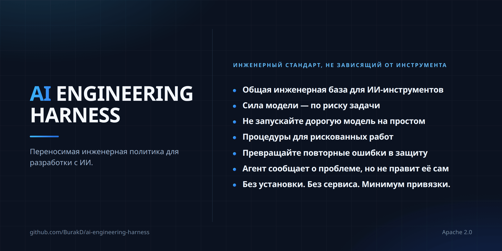

<!-- Based on README.md @ v2.2.0 -->
# AI Engineering Harness



Языки: [English](../README.md) · [Türkçe](README.tr.md) · [Español](README.es.md) · [Português (Brasil)](README.pt-BR.md) · [Deutsch](README.de.md) · [Français](README.fr.md) · Русский · [简体中文](README.zh-CN.md) · [日本語](README.ja.md) · [한국어](README.ko.md) · [العربية](README.ar.md) · [हिन्दी](README.hi.md)

Минимальный и независимый от поставщика (vendor-neutral) слой политик/контекста для разработки ПО с AI и небольшой набор переиспользуемых процедур. Это не agent runtime (среда выполнения агентов), не orchestrator (оркестратор), не installer (установщик) и не framework (программный каркас).

## Что вы получаете

- Единая engineering baseline (инженерная база) для разных инструментов. Cursor, Claude Code, Codex, Antigravity и Kiro читают один и тот же project context (контекст проекта) и constraints (ограничения), поэтому при смене инструмента не нужно заново объяснять проект.
- Выбор модели привязан к риску, а не к привычке. Работа классифицируется по capability tiers (уровням возможностей) и начинается с минимально достаточного уровня. Это policy (политика), а не enforcement (техническое принуждение): фактическая экономия зависит от active runtime (активной среды выполнения) и вашего тарифа.
- Готовые процедуры для работ, где ошибки особенно болезненны. Для secret exposure (утечки секретов), releases (выпусков), dependency changes (изменений зависимостей), high-risk changes (изменений с высоким риском) и recovery (восстановления) есть общая процедура; ни одна процедура не может ослабить approval boundary (границу одобрения).
- Discovery (обнаружение) — не authorization (авторизация). Если agent (агент) замечает проблему вне своей задачи, он сообщает о ней и ждёт решения, а не исправляет её по собственной инициативе.
- Для capabilities (возможностей) действует fail closed (считать недоступным при отсутствии подтверждения). Agent не должен заявлять о model (модели), subagent (субагенте) или skill activation (активации навыка), которые active runtime фактически не может предоставить.
- Context (контекст) остаётся небольшим. Общие процедуры загружаются, когда задача им соответствует, а не заполняют каждую session (сессию).
- Низкий lock-in (уровень привязки). Markdown в вашем repository (репозитории), без installer, runtime или service (сервиса). Adoption (установка) и removal (удаление) — документированные процедуры, а не путь в один конец.

## Файлы

- `AGENTS.md` — общая always-on (постоянно действующая) инженерная база.
- `MODEL_ROUTING.md` — стабильная политика качества/стоимости и capability tier (уровня возможностей).
- `MODEL_CATALOG.md` — изменяемый со временем каталог runtime (среды выполнения) и моделей.
- `CLAUDE.md` — тонкий мост Claude Code к `AGENTS.md`.
- `skills/` — процедуры из Harness-owned (принадлежащего Harness), canonical (единственного авторитетного) источника, on-demand (загружаемые по требованию).
- `i18n/` — локализованные сводки `README.md`.

## Rules (правила) и skills (навыки): четыре слоя

Rules — это постоянно действующие указания; skills — процедуры, которые включаются для конкретных задач.

| | Always-on (постоянно действует) | On-demand (по требованию) |
| --- | --- | --- |
| Общий | `AGENTS.md` + `MODEL_ROUTING.md` | `skills/` |
| Проектный | Собственный механизм rules/policy проекта | Собственные skills проекта |

Harness не предоставляет отдельный каталог `rules/`: canonical source (единственный авторитетный источник) общего always-on-слоя правил уже находится в `AGENTS.md`, а политика model routing — в `MODEL_ROUTING.md`. Второй always-on-источник создавал бы дублирование и риск противоречий.

Доменные правила, топология среды и deployment (развёртывания), предпочтения поставщика/модели, поведение продукта, бизнес-правила и инфраструктурные пути остаются проектными. При выборе слоя для новой инструкции используйте подход выбора минимального долговечного safeguard (защитной меры) из skill `continuous-improvement`.

## Общие skills (навыки)

Skills — процедуры для конкретных задач, а не always-on policy. При progressive disclosure (постепенном раскрытии) обычно видна только discovery metadata (метаданные обнаружения); полный текст `SKILL.md` загружается только тогда, когда задача действительно соответствует.

Canonical source Harness-owned skills — каталог `skills/`, а ownership marker (маркер принадлежности) выглядит так:

```yaml
metadata:
  ai-engineering-harness: "2.0.0"
```

Одноимённый skill без этого ключа не является Harness-owned; он не перезаписывается при adoption (установке) или update (обновлении).

Набор v2 содержит 15 skills:

- `backup-and-recovery-review` — проверка готовности к backup (резервному копированию), restore (восстановлению) и recovery (аварийному восстановлению).
- `interface-qa` — проверка web-, mobile-, desktop-, CLI- и API-интерфейсов.
- `calculation-model-validation` — проверка формул и моделей принятия решений.
- `change-review` — проверка завершённых изменений на регрессии и риски.
- `compatibility-and-rollout` — совместимость, migration (миграция данных/схем), rollout (поэтапное внедрение) и rollback (откат).
- `high-risk-change-review` — дополнительная дисциплина для изменений с высоким влиянием.
- `delegation-strategy` — использование проверенных delegation (делегирования задач) и параллельной работы.
- `dependency-change` — проверка добавления, удаления и повышения версии dependency (зависимости).
- `documentation-sync` — поддержание долговременной документации в соответствии с реальностью.
- `environment-release-safety` — влияние release (выпуска) и deployment (развёртывания), а также безопасность одобрения.
- `automation-cost-control` — контролирует стоимость измеряемых вычислений автоматизации по фактическим расходам, выбирает самый дешёвый достаточный executor (исполнитель), ограничивает runtime (время выполнения) и проверяет, что условия экономии не отключают обязательную работу без сигнала.
- `continuous-improvement` — превращение повторяющихся ошибок в долговечные safeguards (защитные меры).
- `root-cause-debug` — поиск и доказательство корневой причины, а не только симптома.
- `secret-exposure-response` — реагирование на утечку secret (секрета) и credential (учётных данных).
- `cross-surface-consistency` — согласованность поведения между несколькими интерфейсами.

Общий набор должен оставаться примерно 20 skills или меньше; поля `description` должны содержать не более 300 символов.

Порядок приоритета: проектные rules/policy > общая база `AGENTS.md` > общие skills. Skill не может ослаблять approval boundary (границу одобрения), authorized scope (разрешённый охват), runtime capability (возможности среды выполнения) или production/live safety (безопасность продакшена/живой системы).

## Adoption (установка) и update (обновление)

Промпты копирования/вставки хранятся в одной canonical source и не переводятся:

- [Промпт установки (на английском)](../README.md#copypaste-adoption-prompt)
- [Промпт обновления (на английском)](../README.md#copypaste-update-prompt)

Adoption определяет используемые runtimes по repository evidence (доказательствам в репозитории); сам факт установки CLI недостаточен. Проверенные пути skills на уровне проекта: `.agents/skills/` для Cursor, Antigravity и Codex; `.claude/skills/` для Claude Code; `.kiro/skills/` для Kiro. Cursor также может читать `.claude/skills/`. Kiro напрямую обнаруживает `AGENTS.md` в workspace root (корне рабочего пространства) и во вложенных каталогах, поэтому `.kiro/steering/` не создаётся лишь для дублирования базы Harness. Kiro custom agents (пользовательские агенты) обычно наследуют default resources (ресурсы по умолчанию), включая workspace skills и `AGENTS.md`, однако настройка `chat.disableInheritingDefaultResources` может отключить наследование. В этом случае native activation (нативная активация) не заявляется без явного skill resource (ресурса навыка), например `skill://.kiro/skills/**/SKILL.md`, а файлы `.kiro/agents/` не изменяются без одобрения человека. Если один проверенный root (корневой каталог) покрывает все используемые runtimes, применяется одна копия. Если native activation нельзя подтвердить, `harness/skills/` используется как neutral fallback (нейтральный запасной вариант), и факт native activation не заявляется.

Перед записью любого skill все canonical-имена проверяются во всех целевых roots на collision (конфликт имён). Если меняется managed (управляемый) skill, вне repository создаётся backup byte-for-byte (побайтовая резервная копия). Harness-owned копии сохраняются verbatim (полностью идентичными) canonical-источнику. Update не переносит существующее размещение skill; managed skill, удалённый upstream (в вышестоящем источнике), автоматически не удаляется и отмечается как orphaned (отсутствующий в источнике).

## Удаление и тестирование

Автоматического uninstaller (деинсталлятора) нет. Удаляются только managed skills с маркером принадлежности `metadata.ai-engineering-harness`; проектные skills и rules не изменяются. См. [Удаление общих skills (на английском)](../README.md#remove-the-shared-skills).

Если native activation нельзя подтвердить при тесте установки, agent не должен утверждать, что skill активен. Для нерелевантной задачи тела skills не должны загружаться в context (контекст); должна быть видна только discovery metadata. См. [Проверка установки (на английском)](../README.md#how-to-test-an-installation).

Файлы `SKILL.md` не переводятся; сохраняется одна canonical английская копия. Для подробностей по сопровождению, поведению adoption/update и границам охвата основным источником служит [английский `README.md`](../README.md).
