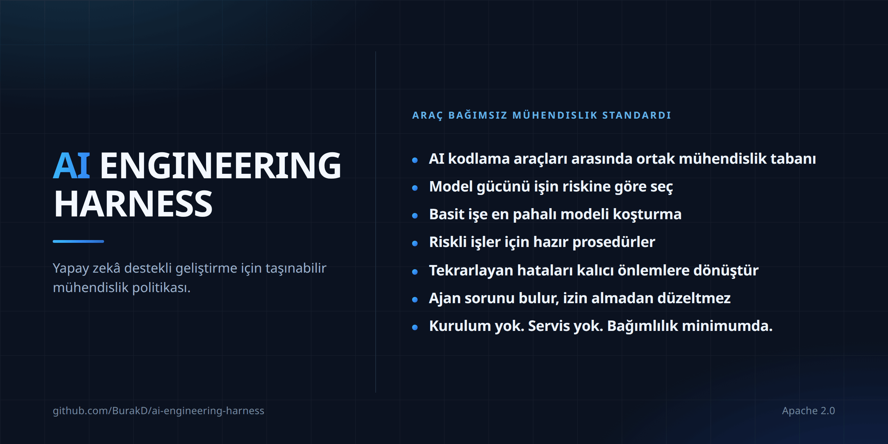

<!-- Based on README.md @ v2.1.0 -->
# AI Engineering Harness



Diller: [English](../README.md) · Türkçe · [Español](README.es.md) · [Português (Brasil)](README.pt-BR.md) · [Deutsch](README.de.md) · [Français](README.fr.md) · [Русский](README.ru.md) · [简体中文](README.zh-CN.md) · [日本語](README.ja.md) · [한국어](README.ko.md) · [العربية](README.ar.md) · [हिन्दी](README.hi.md)

Yapay zekâ destekli yazılım geliştirme için minimal ve sağlayıcıdan bağımsız (vendor-neutral) bir politika/bağlam katmanı ile küçük bir yeniden kullanılabilir prosedür kümesidir. Bir agent runtime (ajan çalışma ortamı), orchestrator (orkestrasyon sistemi), installer (kurulum aracı) veya framework (yazılım çerçevesi) değildir.

## Ne elde edersiniz

- Araçlar arasında tek engineering baseline (mühendislik tabanı). Cursor, Claude Code, Codex, Antigravity ve Kiro aynı project context (proje bağlamı) ve constraints (kısıtları) okur; bu yüzden araç değiştirmek projeyi yeniden anlatmak anlamına gelmez.
- Model seçimi alışkanlığa değil riske bağlıdır. İş capability tiers (yetenek seviyeleri) içinde sınıflandırılır ve yeterli olan en düşük seviyeden başlar. Bu, enforcement (zorlama) değil policy'dir (politika): gerçekte ne kazandırdığı active runtime'a (aktif çalışma ortamına) ve planınıza bağlıdır.
- Yanlış gittiğinde can yakan işler için hazır prosedürler. Secret exposure (sır sızıntısı), releases (yayınlar), dependency changes (bağımlılık değişiklikleri), high-risk changes (yüksek riskli değişiklikler) ve recovery (kurtarma) için ortak birer prosedür vardır; hiçbir prosedür approval boundary'yi (onay sınırını) gevşetemez.
- Discovery (keşif), authorization (yetkilendirme) değildir. Bir agent (ajan), görevinin dışında bir sorun fark ederse kendi inisiyatifiyle düzeltmek yerine raporlar ve karar bekler.
- Capabilities (yetenekler) konusunda fail closed (doğrulanamadığında kapalı) davranır. Bir agent, active runtime'ın gerçekten sağlayamadığı bir model, subagent (alt ajan) veya skill activation (beceri etkinleştirme) iddiasında bulunmamalıdır.
- Context (bağlam) küçük kalır. Paylaşılan prosedürler her session'ı (oturumu) doldurmak yerine görevle eşleştiğinde yüklenir.
- Low lock-in (düşük bağımlılık). Repository'nizde (kod deponuzda) Markdown; installer, runtime veya service (hizmet) yok. Adoption (kurulum) ve removal (kaldırma), tek yönlü bir kapı değil, dokümante edilmiş prosedürlerdir.

## Dosyalar

- `AGENTS.md` — paylaşılan always-on (sürekli etkin) mühendislik tabanı.
- `MODEL_ROUTING.md` — kararlı kalite/maliyet ve capability tier (yetenek seviyesi) politikası.
- `MODEL_CATALOG.md` — zamanla değişen runtime (çalışma ortamı) ve model kataloğu.
- `CLAUDE.md` — Claude Code için `AGENTS.md` dosyasına yönlendiren ince köprü.
- `skills/` — Harness-owned (Harness'a ait), canonical (tek yetkili) kaynaktan gelen, on-demand (gerektiğinde yüklenen) prosedürler.
- `i18n/` — yerelleştirilmiş `README.md` özetleri.

## Rules (kurallar) ve skills (beceriler): dört katman

Rules sürekli geçerli olan yönlendirmedir; skills ise belirli görevlerde devreye giren prosedürlerdir.

| | Always-on (sürekli etkin) | On-demand (gerektiğinde) |
| --- | --- | --- |
| Paylaşılan | `AGENTS.md` + `MODEL_ROUTING.md` | `skills/` |
| Projeye özel | Projenin kendi rules/policy mekanizması | Projenin kendi skills'i |

Harness ayrı bir `rules/` dizini sunmaz: paylaşılan always-on kural katmanının canonical kaynağı zaten `AGENTS.md`'dir, model yönlendirme politikası ise `MODEL_ROUTING.md`'dedir. İkinci bir always-on kaynak tekrar ve çelişki riski doğurur.

Alan kuralları, ortam ve deployment (dağıtım) topolojisi, sağlayıcı/model tercihleri, ürün davranışı, iş kuralları ve altyapı yolları projeye özel kalır. Yeni bir rehberliğin hangi katmana ait olduğuna karar verirken `continuous-improvement` skill'indeki en küçük kalıcı safeguard'ı (koruyucu önlem) seçme yaklaşımını kullanın.

## Paylaşılan skills (beceriler)

Skills göreve özgü prosedürlerdir, always-on policy değildir. Progressive disclosure (kademeli gösterim) yaklaşımında normalde yalnız discovery metadata (keşif üst verisi) görünür; tam `SKILL.md` gövdesi ancak görev gerçekten eşleştiğinde yüklenir.

Harness-owned skills'in canonical kaynağı `skills/` dizinidir ve ownership marker (sahiplik işareti) şudur:

```yaml
metadata:
  ai-engineering-harness: "2.0.0"
```

Aynı isimli bir skill bu anahtarı taşımıyorsa Harness-owned değildir; adoption (kurulum) veya update (güncelleme) sırasında üzerine yazılmaz.

v2 kümesi 14 skill içerir:

- `backup-and-recovery-review` — backup (yedekleme), restore (geri yükleme) ve recovery (kurtarma) hazırlığının incelenmesi.
- `interface-qa` — web, mobil, masaüstü, CLI ve API arayüzlerinin doğrulanması.
- `calculation-model-validation` — formül ve karar modellerinin doğrulanması.
- `change-review` — tamamlanmış değişikliklerin regresyon ve risk incelemesi.
- `compatibility-and-rollout` — uyumluluk, migration (veri/şema geçişi), rollout (aşamalı yayına alma) ve rollback (geri dönüş).
- `high-risk-change-review` — yüksek etkili değişikliklerde ek disiplin.
- `delegation-strategy` — doğrulanmış delegation (görev devri) ve paralel çalışma kullanımı.
- `dependency-change` — dependency (bağımlılık) ekleme, kaldırma ve sürüm yükseltme incelemesi.
- `documentation-sync` — kalıcı dokümantasyonun gerçekle eşzamanlı tutulması.
- `environment-release-safety` — release (yayın) ve deployment (dağıtım) etkisi ile onay güvenliği.
- `continuous-improvement` — tekrarlanan hataların kalıcı safeguard'lara (koruyucu önlemlere) dönüştürülmesi.
- `root-cause-debug` — belirti yerine kök nedenin bulunup kanıtlanması.
- `secret-exposure-response` — secret (sır) ve credential (kimlik bilgisi) sızıntısına müdahale.
- `cross-surface-consistency` — birden çok arayüzde davranış tutarlılığı.

Paylaşılan küme yaklaşık 20 skill veya altında tutulmalıdır; `description` alanları 300 karakter veya daha kısa olmalıdır.

Öncelik sırası: projeye özel rules/policy > paylaşılan `AGENTS.md` tabanı > paylaşılan skills. Bir skill; approval boundary (onay sınırı), authorized scope (yetkili kapsam), runtime capability (çalışma ortamı yeteneği) veya production/live safety (üretim/canlı sistem güvenliği) kurallarını gevşetemez.

## Adoption (kurulum) ve update (güncelleme)

Kopyala/yapıştır prompt'ları tek canonical kaynakta tutulur ve çevrilmez:

- [Kurulum prompt'u (İngilizce)](../README.md#copypaste-adoption-prompt)
- [Güncelleme prompt'u (İngilizce)](../README.md#copypaste-update-prompt)

Adoption, kullanılan runtime'ları repository evidence'tan (kod deposundaki kanıtlardan) belirler; makinede bir CLI kurulu olması tek başına yeterli değildir. Doğrulanmış proje düzeyindeki skill yolları şöyledir: Cursor, Antigravity ve Codex için `.agents/skills/`; Claude Code için `.claude/skills/`; Kiro için `.kiro/skills/`. Cursor ayrıca `.claude/skills/` yolunu okuyabilir. Kiro, workspace-root (çalışma alanı kökü) ve iç dizinlerdeki `AGENTS.md` dosyalarını doğrudan keşfeder; bu nedenle yalnız Harness tabanını kopyalamak için `.kiro/steering/` oluşturulmaz. Kiro custom agents (özel ajanlar) normalde default resources'ı (varsayılan kaynakları), dolayısıyla workspace skills'i ve `AGENTS.md`'yi miras alır; ancak `chat.disableInheritingDefaultResources` ayarı bu mirası kapatabilir. Bu durumda ilgili agent kaynaklarında `skill://.kiro/skills/**/SKILL.md` gibi açık bir skill resource (beceri kaynağı) bulunmadan native activation iddia edilmez ve `.kiro/agents/` dosyaları insan onayı olmadan değiştirilmez. Tek bir doğrulanmış root (kök dizin) kullanılan tüm runtime'ları kapsıyorsa tek kopya kullanılır. Native activation (yerel etkinleştirme) doğrulanamıyorsa `harness/skills/` neutral fallback (tarafsız alternatif) olarak kullanılır ve native activation gerçekleşmiş gibi gösterilmez.

Herhangi bir skill yazılmadan önce tüm canonical isimler, tüm hedef root'larda collision (ad çakışması) açısından taranır. Değiştirilecek managed (yönetilen) bir skill varsa repository dışında byte-for-byte (bayt bayt birebir) yedek alınır. Harness-owned kopyalar canonical kaynakla verbatim (birebir) tutulur. Update mevcut skill yerleşimini taşımaz; upstream'den (üst kaynaktan) kaldırılmış managed skill otomatik silinmez, orphaned (kaynakta olmayan) olarak raporlanır.

## Kaldırma ve test

Otomatik uninstaller (kaldırma aracı) yoktur. Yalnız `metadata.ai-engineering-harness` sahiplik işaretini taşıyan managed skills kaldırılır; projeye özel skills ve rules'a dokunulmaz. Ayrıntı için [Paylaşılan skills'i kaldırma (İngilizce)](../README.md#remove-the-shared-skills).

Kurulum testinde native activation doğrulanamıyorsa agent, skill'in aktif olduğunu iddia etmemelidir. Alakasız bir görevde skill gövdeleri context'e (bağlama) yüklenmemeli, yalnız discovery metadata görünmelidir. Ayrıntı için [Kurulumu test etme (İngilizce)](../README.md#how-to-test-an-installation).

`SKILL.md` dosyaları çevrilmez; tek canonical İngilizce kopya korunur. Ayrıntılı bakım, adoption/update davranışı ve kapsam sınırları için [İngilizce `README.md`](../README.md) esas kaynaktır.
